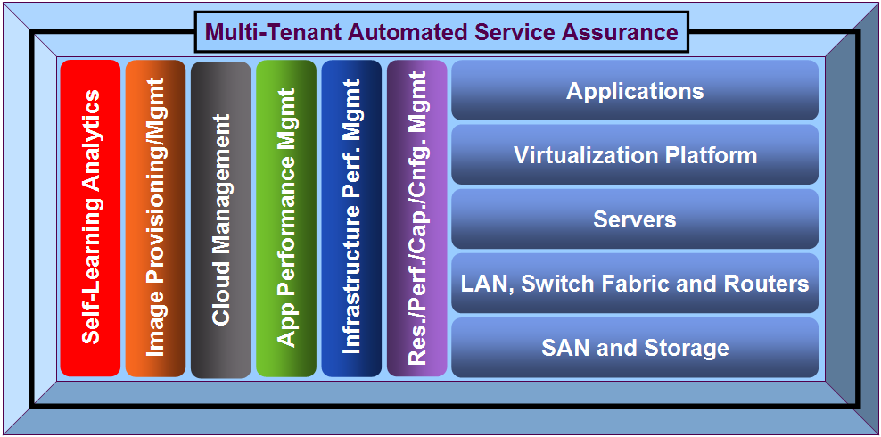
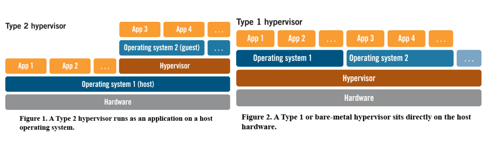
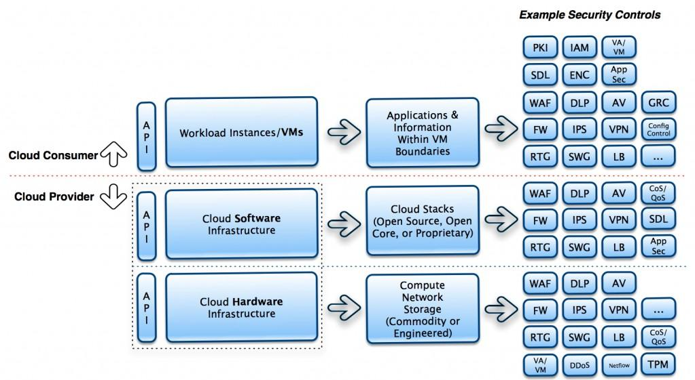
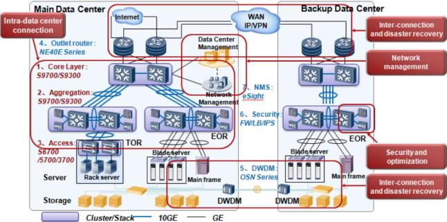

# Topics of Study

---

## Cloud Management

Source: [http://www.virtualizationpractice.com](http://www.virtualizationpractice.com)

---

## Virtualization and Hypervisors

Source : [http://www.virtzone.net/](http://www.virtzone.net)
[http://ecnmag.com](http://ecnmag.com)

---

## APIs to Securely Access Cloud

Source: [http://www.porticor.com/wp-content/uploads/2010/10/CloudSecurityStack-1024x5771.jpg](http://www.porticor.com/wp-content/uploads/2010/10/CloudSecurityStack-1024x5771.jpg)
---

## Data Center as a Building Block

- Previously (e.g., dot-com era)
    - Smaller in size, but made up of special purpose, expensive hardware
    - Network that was deep and narrow: a small failure and the data center
    could not be accessed
    - Predominantly meant for enterprise computing
- Today
    - Deployment of cheap, commodity hardware
    - Geographically distributed, i.e., multiple data centers
    - Network that is thin and wide—ability to withstand failures better while
    keeping the system operational
    - Wide variety of applications hosted (e.g., Google search)

---

## Typical Networking Inside Data Centers

Source: [http://enterprise.huawei.com/](http://enterprise.huawei.com/)
---