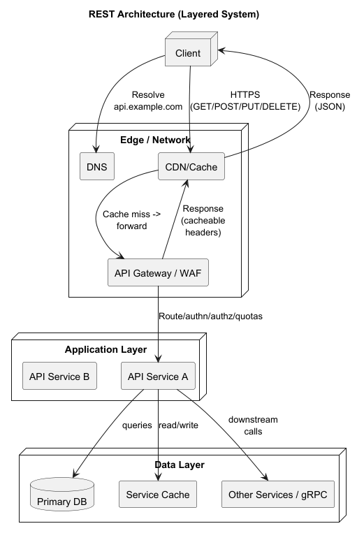

# REST in Practice: How It Works

Video: (https://youtu.be/0SPwD-7mwaI)[https://youtu.be/0SPwD-7mwaI]

---

## REST’s Six Constraints (Refresher)
1. **Client–Server**  
   – Separation of concerns: UI vs. data/store.
2. **Stateless**  
   – Each request contains all context; servers need not retain session state.
3. **Cacheable**  
   – Responses declare if and how they can be cached (HTTP headers).
--- 

## REST's Six Constraints (cont)

4. **Uniform Interface**  
   – Consistent method semantics, resource identification, and representation formats.
5. **Layered System**  
   – Clients need not know whether they talk directly to the end server or an intermediary.
6. **Code on Demand (optional)**  
   – Servers can extend client functionality by sending executable code (e.g., JavaScript).

---

## CRUD ↔ HTTP Methods Mapping

A simple visual mapping showing how the four basic database operations (Create, Read, Update, Delete) correspond to standard HTTP methods in a REST API:

|  CRUD   | HTTP Method / Semantics       |
|---------|-------------------------------|
| Create  | POST    (non-idempotent)      |  
| Read    | GET     (safe, cacheable)     |  
| Update  | PUT     (idempotent, full), PATCH   (idempotent, partial) |  
| Delete  | DELETE  (idempotent)          |  

--- 
## CRUD Description:

- **Create → POST**: submits a new resource payload to the server, which assigns it a unique URI.
- **Read → GET**: retrieves a representation of a resource or collection without side-effects; responses may be cached.
- **Update → PUT**: replaces the entire resource at the given URI with the provided representation (or creates it if missing).
- **Update → PATCH**: applies a partial change or “delta” document to an existing resource.
- **Delete → DELETE**: removes the resource at the specified URI; safe to repeat.

---

## Idempotency & Safety:

- **Safe methods** (GET) do not modify server state.
- **Idempotent methods** (GET, PUT, PATCH, DELETE) have the same effect when repeated.
- **Non-idempotent** actions (POST) may create multiple resources if replayed.

This alignment ensures that clients can predict how requests behave and helps intermediaries (caches, proxies) treat each interaction correctly.

---

## How REST Works
- **Client-Server**: clients send requests to a server, which returns responses.
- **Stateless**: each request contains all context, no session state.
- **Cacheable**: responses declare if and how they can be cached.
- **Uniform Interface**: consistent method semantics, resource identification, and representation formats.
- **Layered System**: clients need not know whether they talk directly to the end server or an intermediary.
- **Code on Demand (optional)**: servers can extend client functionality by sending executable code (e.g., JavaScript).

---

## REST Architecture Diagram



## HTTP as REST’s Vehicle
- Resources are **nouns** in the URL (e.g., `/users`, `/orders/123`)
- Actions map to HTTP methods with well-defined semantics:
    - GET
    - POST
    - PUT
    - PATCH
    - DELETE

---

## GET
- Safe (no side-effects) & idempotent  
- Retrieve one or more resources  
-  Example: `GET /products/42` → 200 OK + JSON body

## POST

- Not idempotent (repeating may create duplicates)  
- Create a new subordinate resource or submit data for processing  
- Example: `POST /orders` with JSON payload → 201 Created + Location header

--- 

## PUT

- Idempotent (repeated calls have same effect)  
- Full replace or upsert at the client-specified URI  
- Example: `PUT /users/42` with complete user object → 200 OK or 201 Created

## PATCH

- Idempotent per spec (partial updates)  
- Apply a delta or merge document  
- Example: `PATCH /users/42` `{ "email":"new@domain" }` → 200 OK or 204 No Content

---

## DELETE
- Idempotent (deleting twice is safe)  
- Remove resource at given URI  
- Example: `DELETE /sessions/99` → 204 No Content

---

## Uniform Interface in Depth
- **Resource-Based URLs**: use nouns, avoid verbs in paths (e.g., `/invoices/2025-07-01`).
- **Self-Descriptive Messages**:  
  • HTTP headers convey media type (`Content-Type: application/json`), caching (`Cache-Control`), auth (`WWW-Authenticate`).  
  • Body contains data in a standard format (JSON, XML).
- **Hypermedia (HATEOAS)**: include links in responses to guide clients (e.g., `"links": { "self":"/users/42", "orders":"/users/42/orders" }`).

---

## HTTP Status Codes Explained

### 2xx Success
- **200 OK**: general success, returns payload.
- **201 Created**: new resource created; include `Location` header.
- **202 Accepted**: request accepted but processing asynchronously.
- **204 No Content**: success with no response body (e.g., DELETE).

---

## HTTP Status Codes Explained

### 3xx Redirection
- **301 Moved Permanently**: resource URI changed permanently.
- **302 Found**: temporary redirect.
- **304 Not Modified**: client’s cached copy is still valid.

---- 

## HTTP Status Codes Explained

### 4xx Client Errors
- **400 Bad Request**: malformed syntax or invalid fields.
- **401 Unauthorized**: authentication required or failed.
- **403 Forbidden**: authenticated but not allowed.
- **404 Not Found**: requested resource does not exist.
- **409 Conflict**: version mismatch, duplicate resource.
- **422 Unprocessable Entity**: semantic errors in request.
- **429 Too Many Requests**: rate limiting threshold exceeded.

---

## HTTP Status Codes Explained

### 5xx Server Errors
- **500 Internal Server Error**: unexpected failure.
- **502 Bad Gateway**: invalid response from upstream.
- **503 Service Unavailable**: overloaded or maintenance mode.
- **504 Gateway Timeout**: upstream did not respond in time.

---
## Best Practice

Return a JSON error object, e.g.:

```json
{ 
  "status": 422, 
  "error": "Unprocessable Entity", 
  "message": "Field ‘email’ must be a valid address", 
  "details": { "field": "email" } 
}
```

---

## JSON Everywhere
- Ubiquitous format: human-readable, language-agnostic
- Lightweight compared to XML; wide support in HTTP clients/servers
- Use consistent naming (snake_case vs. camelCase) and include schema links when appropriate

---

## Example REST Call (with Error Handling)

### Example: fetch a user, handle success and error responses

```shell 
curl -i -X GET \
"https://api.example.com/users/123" \
-H "Accept: application/json" \
-H "Authorization: Bearer <token>"
```
--- 

## On Success (200 OK)
```http 
HTTP/1.1 200 OK
 Content-Type: application/json
 Cache-Control: max-age=60

{
  "id": 123,
  "name": "Alice",
  "email": "alice@example.com",
  "links": {
    "self": "/users/123",
    "orders": "/users/123/orders"
  }
}
```
---

## On Not Found (404)
```http

HTTP/1.1 404 Not Found
 Content-Type: application/json
 
 {
   "status": 404,
   "error": "Not Found",
   "message": "User 123 does not exist",
   "timestamp": "2025-08-09T14:23:45Z"
 }
```
---

## On Unauthorized (401)
```http
 HTTP/1.1 401 Unauthorized
 Content-Type: application/json
 WWW-Authenticate: Bearer realm="api.example.com"
 
 {
   "status": 401,
   "error": "Unauthorized",
   "message": "Invalid or missing authentication token"
 }
```

---

## On Server Error (500)
```http
 HTTP/1.1 500 Internal Server Error
 Content-Type: application/json
 
 {
   "status": 500,
   "error": "Internal Server Error",
   "message": "An unexpected error occurred. Please try again later."
 }
```