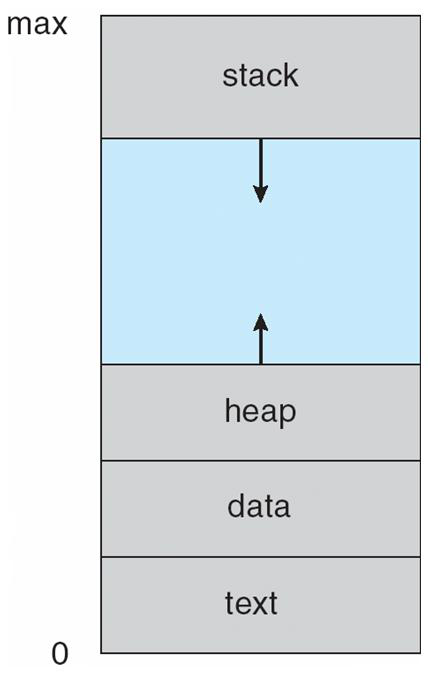
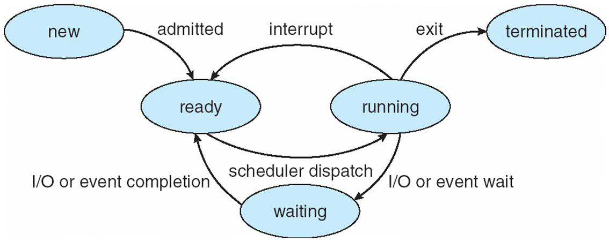
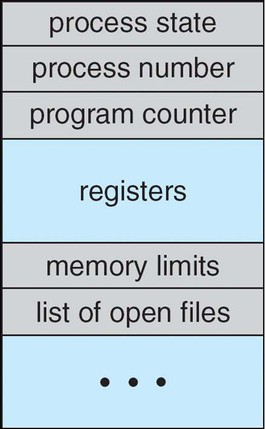
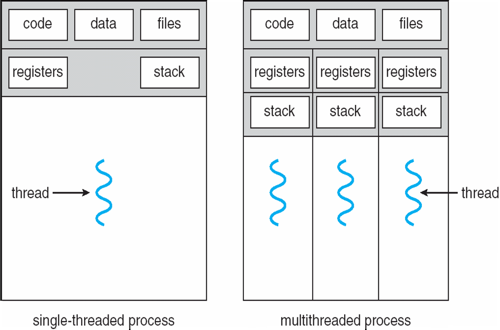

  # Processs Management

  Video: [https://youtu.be/gKxkOrSK0Fs](https://youtu.be/gKxkOrSK0Fs)

--- 

## Process Concept
- An operating system executes a variety of programs
    - Batch system: jobs
    - Time -shared systems: user programs or tasks
- Textbook uses the terms job and process almost interchangeably
- Process: a program in execution; process execution must
- progress in sequential fashion
- A process includes:
    - Program counter
    - Stack
    - Data section Process Concept

---

## Process in Memory



- Stack: Region containing function call stack, local variables, and temporary data
- Heap: Dynamic memory allocation region for objects and data structures
- Data: Contains global variables and static data initialized by the program
- Text: Program instructions and read-only data like string literals


---
## Process State



* As a process executes, it changes state.
    * New: The process is being created.
    * Running: Instructions are - being executed
    * Waiting: The process is waiting for some event to occur.
    * Ready: The process is waiting to be assigned to a processor.
    * Terminated: The process has terminated.


---

## Process Control Block (PCB)



Information associated with each process

- Process state
- Program counter
- CPU registers
- CPU scheduling information
- Memory management information
- Accounting information
- I/O status information


---
## Process Creation
- Parent process creates children processes, which in turn create other processes, forming a tree of processes
- Generally, process identified and managed via a process identifier (PID)
- Resource sharing
    - Parent and children share all resources
    - Children share subset of parent’s resources
    - Parent and child share no resources
- Execution
    - Parent and children execute concurrently
    - Parent waits until children terminate Process Creation

---
## Sample Process Tree (on Linux)
```shell
% ps -aux
USER       PID %CPU %MEM    VSZ   RSS TTY      STAT START   TIME COMMAND
root         1  0.0  0.0  18684  2364 ?        Ss   10:55   0:00 /sbin/init
root         2  0.0  0.0      0     0 ?        S    10:55   0:00 [kthreadd]
root         3  0.0  0.0      0     0 ?        S<   10:55   0:00 [ksoftirqd/0]
root         5  0.0  0.0      0     0 ?        S<   10:55   0:00 [kworker/0:0H]
root         6  0.0  0.0      0     0 ?        S<   10:55   0:00 [rcu_sched]
root         7  0.0  0.0      0     0 ?        S<   10:55   0:00 [rcu_bh]
root         8  0.0  0.0      0     0 ?        S<   10:55   0:00 [migration/0]
root         10 0.0  0.0      0      0 ?       S<   10:55   0:00 [watchdog/0]
root         11 0.0  0.0      0      0 ?       S<   10:55   0:00 [cpuhp/0]
root         12 0.0  0.0      0      0 ?       S<   10:55   0:00 [cpuhp/1]
```

---

## Process Creation (cont.)

- Address space
    - Child duplicate of parent
    - Child has a program loaded into it
- UNIX examples
    - Fork system call creates new process
    - Exec system call used after a fork to replace the process memory space with a new program Process Creation (cont.)

---

## Single and Multithreaded Processes



| Single threaded processes | Multithreaded processes |
| --- |-------------------------|
| One Code | One Code                |
| One Data | One Data                |
| One set of Files | One set of Files |
| One thread of execution | Multiple thread of execution |
| One program counter | Multiple program counters |
| One stack | Multiple Stacks |
| One heap | Multiple Heaps |

---

# Process/Thread Scheduling

---

## CPU Scheduler
- Selects from among the processes in memory that are ready to execute, and allocates the CPU to one of them
- CPU scheduling decisions may take place when a process:
    1. Switches from running to waiting state
    2. Switches from running to ready state
    3. Switches from waiting to ready
    4. Terminates

- Scheduling under i and iv is non-preemptive
- All other scheduling is preemptive CPU Scheduler

---

## Context Switch

- When CPU switches to another process, the system must
save the state of the old process and load the saved state
for the new process via a context switch
- Context of a process represented in the PCB
- Context switch time is overhead; the system does no
useful work while switching
- Time dependent on hardware support 

---

## Dispatcher

- Dispatcher module gives control of the CPU to the
process selected by the short -term scheduler; this
involves:
    - Switching context
    - Switching to user mode
    - Jumping to the proper location in the user program to restart that program
- Dispatch latency: time it takes for the dispatcher to stop one process and start another running Dispatcher

---

## Scheduling Criteria

- CPU utilization: keep the CPU as busy as possible
- Throughput: number of processes that complete their execution per time unit
- Turnaround time: amount of time to execute a particular process
- Waiting time: amount of time a process has been waiting in the ready queue
- Response time: amount of time it takes from when a request was submitted until the first response is produced, not output (for time - sharing environment)
