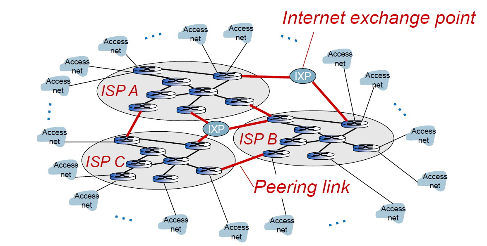
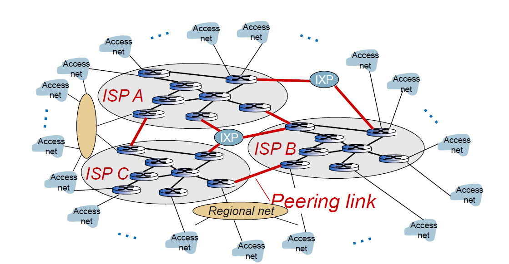
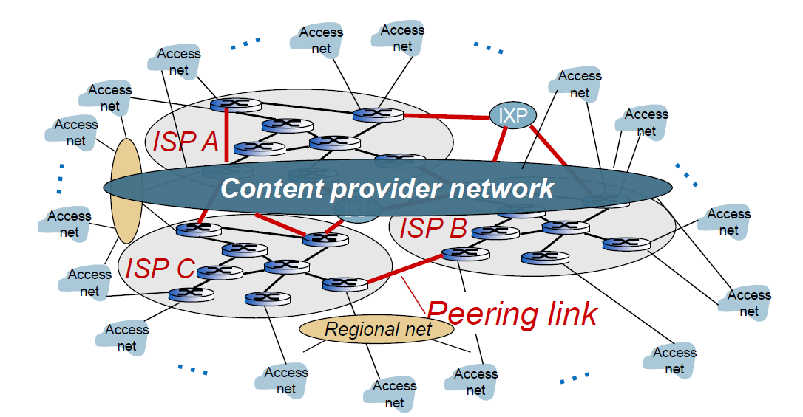

  # Internet Architecture

---

## What's The Internet: A Service View

- Infrastructure that provides services to applications
    - Web, VoIP, email, games, e -commerce, social nets, ...
- Provides programming interface to apps
    - Hooks that allow sending and receiving app programs to “connect” to Internet
    - Provides service options, analogous to postal service

---

## A Closer Look at the Network Structure
- Network edge
    - Hosts: clients and servers
    - Servers often in data centers
- Access networks, physical media :
    - wired, 
    - wireless communication links
- Network core
    - Interconnected routers
    - Network of networks

---
## Access Networks and Physical Media
- Question: How to connect end systems to edge router?
    - Residential access nets
    - Institutional access networks (school, company)
    - Mobile access networks
- Issues to keep in mind
    - Bandwidth (bits per second) of access network?
    - Shared or dedicated?
    - Reliability

---

## The Network Core
- Mesh of interconnected routers
- Packet -switching: hosts break application layer messages into packets
    - Forward packets from one router to the next, across links on path from source to destination
    - Each packet transmitted at full link capacity
---

## Internet Structure: Network of Networks

- End systems connect to Internet via access ISPs (Internet Service Providers).
    - Residential, company, and university ISPs
- Access ISPs in turn must be interconnected.
    - So that any two hosts can send packets to each other
- Resulting network of networks is very complex.
    - Evolution was driven by economics and national policies
- Let’s take a stepwise approach to describe current Internet structure. 

---

## Internet Structure: Network of Networks
- But if one global ISP is viable business, there will be competitors… which must be interconnected…

---

## Internet Structure: Network of Networks
... And Regional networks may arise to connect access nets to ISPs

---

## Internet Structure: Network of Networks

... And content provider networks (e.g., Google, Microsoft, Akamai) may run their own network, to bring services, content close to end users

---