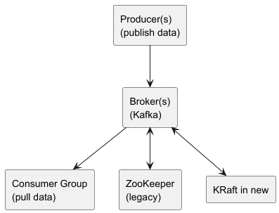

# Apache Kafka Primer

Apache Kafka is a high-throughput, distributed event streaming platform. It implements a **distributed log** design pattern: producers append immutable records to a partitioned, replicated log; consumers read at their own pace by maintaining offsets.

## 1. Design Pattern

- **Distributed Commit Log**
  – Topics are divided into partitions (ordered, immutable sequence of records).
  – Producers append records to partitions; Kafka guarantees ordering within a partition.
  – Consumers track offsets and pull batches of records.
- **Pub/Sub with Consumer Groups**
  – Multiple consumers in a group share (compete for) partitions: each record delivered to exactly one consumer in the group (competing-consumer pattern).
  – Multiple groups can independently consume the same topic (fan-out between groups).
- **Replayability**
  – Offsets are kept in Kafka (or external stores): consumers can rewind/replay from an earlier offset.

## 2. Kafka Architecture



- **Brokers**
  – Store topic partitions on disk; serve reads/writes.
  – Elect a **leader** per partition; followers replicate leader’s log for fault tolerance.
- **ZooKeeper (legacy)**
  – Manages cluster metadata, leader election, ACLs.
  – Newer Kafka (KRaft mode) can operate without ZooKeeper.
- **Clients**
  – **Producers**: push records to topics.
  – **Consumers**: pull records, commit offsets.
  – **Admin**: create/delete topics, manage ACLs, quotas.

## 3. Manual (VM) Deployment

### Prerequisites

- 3+ Linux VMs (2 vCPU, 4 GB RAM)
- Java 11+ installed

### Steps

1. **Install ZooKeeper (if using legacy mode)**

``` bash
   wget https://downloads.apache.org/zookeeper/zookeeper-3.8.1/apache-zookeeper-3.8.1-bin.tar.gz
   tar xzf apache-zookeeper-3.8.1-bin.tar.gz
   cd apache-zookeeper-3.8.1-bin
   cp conf/zoo_sample.cfg conf/zoo.cfg
   # Edit dataDir & clientPort in conf/zoo.cfg
   bin/zkServer.sh start
```

-  **Install Kafka Broker**

``` bash
   wget https://downloads.apache.org/kafka/3.5.0/kafka_2.13-3.5.0.tgz
   tar xzf kafka_2.13-3.5.0.tgz
   cd kafka_2.13-3.5.0
```

- Edit `config/server.properties`:

``` properties
     broker.id=1
     listeners=PLAINTEXT://:9092
     log.dirs=/var/lib/kafka-logs
     zookeeper.connect=<zk_host>:2181
```

- Start Broker:

``` bash
     bin/kafka-server-start.sh config/server.properties
```

- **Create Topics & Test**

``` bash
   bin/kafka-topics.sh --create --topic my-topic \
     --bootstrap-server localhost:9092 --partitions 3 --replication-factor 1

   # Produce
   bin/kafka-console-producer.sh \
     --topic my-topic --bootstrap-server localhost:9092

   # Consume
   bin/kafka-console-consumer.sh \
     --topic my-topic --bootstrap-server localhost:9092 --from-beginning
```

## 4. Docker Deployment

### Kafka + ZooKeeper (Single-node)

``` yaml
# docker-compose.yml
version: '3.8'
services:
  zookeeper:
    image: bitnami/zookeeper:3.8
    environment:
      - ALLOW_ANONYMOUS_LOGIN=yes
  kafka:
    image: bitnami/kafka:3.5
    ports:
      - "9092:9092"
    environment:
      - KAFKA_BROKER_ID=1
      - KAFKA_LISTENERS=PLAINTEXT://:9092
      - KAFKA_ZOOKEEPER_CONNECT=zookeeper:2181
    depends_on:
      - zookeeper
```

``` bash
docker-compose up -d
```

## 5. Kubernetes Deployment (StatefulSet + KRaft)

### Example Manifests

* **Namespace & StorageClass**

``` yaml
   apiVersion: v1
   kind: Namespace
   metadata:
     name: kafka
   ---
   # Ensure a StorageClass is available for PVCs
```

* **Kafka StatefulSet** (KRaft mode, no ZooKeeper)

``` yaml
   apiVersion: apps/v1
   kind: StatefulSet
   metadata:
     name: kafka
     namespace: kafka
   spec:
     serviceName: "kafka"
     replicas: 3
     selector:
       matchLabels: { app: kafka }
     template:
       metadata:
         labels: { app: kafka }
       spec:
         containers:
         - name: kafka
           image: confluentinc/cp-kafka:8.10.0
           env:
             - name: KAFKA_PROCESS_ROLES
               value: broker,controller
             - name: KAFKA_NODE_ID
               valueFrom:
                 fieldRef: { fieldPath: metadata.name }
             - name: KAFKA_CONTROLLER_QUORUM_VOTERS
               value: "kafka-0@kafka-0.kafka.kafka.svc.cluster.local:9093,..."
             - name: KAFKA_LISTENERS
               value: PLAINTEXT://0.0.0.0:9092,CONTROLLER://0.0.0.0:9093
             - name: KAFKA_CONTROLLER_LISTENER_NAMES
               value: CONTROLLER
             - name: KAFKA_ADVERTISED_LISTENERS
               value: PLAINTEXT://kafka-0.kafka.kafka.svc.cluster.local:9092
           ports:
             - containerPort: 9092
             - containerPort: 9093
           volumeMounts:
             - mountPath: /var/lib/kafka/data
               name: kafka-data
     volumeClaimTemplates:
       - metadata:
           name: kafka-data
         spec:
           accessModes: ["ReadWriteOnce"]
           resources:
             requests:
               storage: 10Gi
```
* **Headless Service**
``` yaml
   apiVersion: v1
   kind: Service
   metadata:
     name: kafka
     namespace: kafka
   spec:
     clusterIP: None
     selector:
       app: kafka
     ports:
       - port: 9092
```

### Deploy

``` bash
kubectl apply -f namespace.yaml
kubectl apply -f kafka-headless-svc.yaml
kubectl apply -f kafka-statefulset.yaml
```

## 6. Summary

- Kafka uses a **distributed log** pattern with pub/sub semantics and replayable offsets.
- **Architecture** comprises brokers, (ZooKeeper or KRaft) controllers, producers, and consumers.
- **Manual install** requires JVM, ZooKeeper, broker configs, topic creation, and CLI clients.
- **Containerized** deployments simplify setup via Docker Compose or Kubernetes StatefulSets, PVCs, and headless services.
