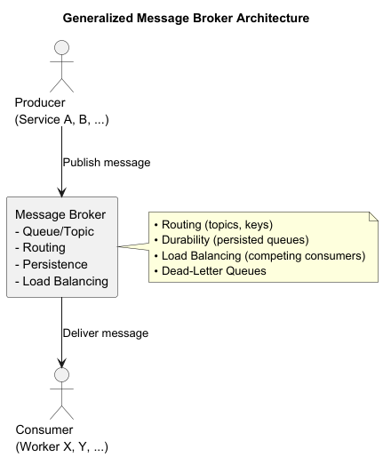
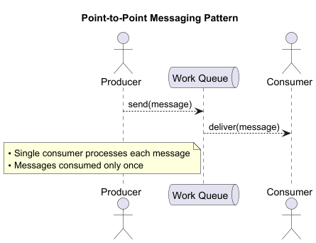
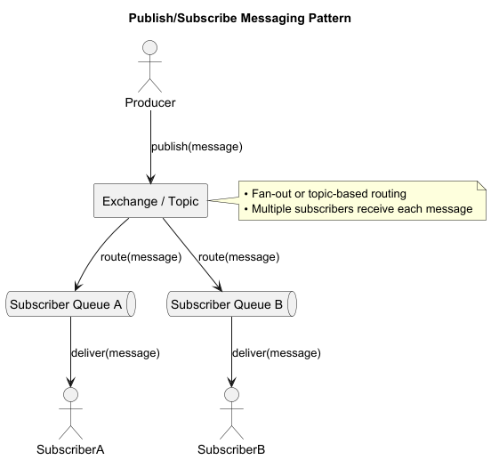
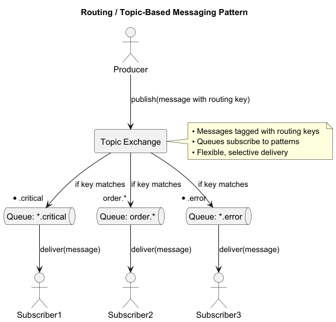
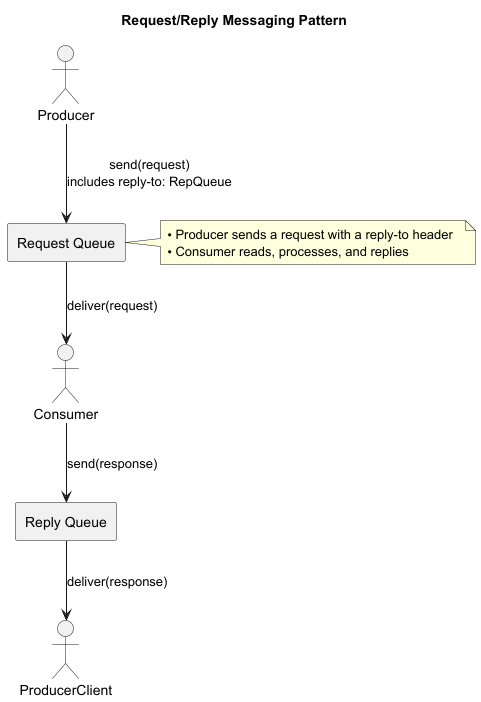

# Message Brokers Overview

Middleware for reliable, decoupled, asynchronous communication  
Producers → Broker → Consumers  
Features: durability, routing, load balancing, traffic shaping

---

## Why Use a Message Broker?

- Decoupling of producers & consumers
- Asynchronous, non-blocking workflows
- Scalability via competing consumers
- Reliability: persisted messages survive failures
- Advanced routing & transformation
- Traffic shaping & rate limiting

---

## Popular Message Broker Platforms

- **RabbitMQ** (AMQP, exchanges–direct/fanout/topic)
- **Apache Kafka** (distributed log, high throughput, replayable)
- **ActiveMQ / Artemis** (JMS-compliant, multi-protocol)
- **AWS SQS & SNS** (fully managed queues & pub/sub)
- **Google Cloud Pub/Sub** (global, auto-scaling, at-least-once/exactly-once)

---

## Common Messaging Patterns

1. **Point-to-Point (Work Queue)**
2. **Publish/Subscribe (Fan-out)**
3. **Routing (Topic / Pattern Matching)**
4. **Request/Reply (RPC-style)**
5. **Competing Consumers**
6. **Dead-Letter Queues**

---

## Pattern: Point-to-Point

Producer → Queue → Single consumer  
Use case: background jobs, task offload

---

## Pattern: Publish/Subscribe

Producer → Exchange/Topic → Multiple queues → Multiple consumers  
Use case: broadcasting events, notifications

---

## Pattern: Routing / Topics

- Messages carry routing keys
- Consumers subscribe with patterns (e.g. `order.*`)
- Selective delivery of events

---

## Pattern: Request/Reply

1. Producer sends request + `reply-to`
2. Consumer processes & replies  
   Use case: RPC between microservices

---

## Deployment Models

### Self-Managed Brokers

- Install on VMs or Kubernetes
- Full control: configs, plugins, network
- You manage HA, upgrades, scaling

### Managed Services

- AWS SQS/SNS, Azure Service Bus, GCP Pub/Sub, Amazon MQ
- Provider handles provisioning & scaling
- Limited low-level customization

---

## High Availability & Scaling

- **Clustering**
    - RabbitMQ clusters, mirrored queues
    - Kafka brokers + partition replicas
- **Auto-Scaling**
    - K8s Operators (Strimzi for Kafka)
    - VM group scaling on metrics
- **Geo-Replication**
    - Multi-AZ clusters, MirrorMaker, Federation

---

## Security & Configuration

- TLS for in-transit encryption
- AuthN/AuthZ: SASL, OAuth2, IAM roles
- Role-based access controls & policies
- Durable queues & retention policies
- Backups & disaster recovery

---

## Monitoring & Observability

- Export metrics (Prometheus, CloudWatch, Stackdriver)
- Key metrics: message rate, queue depth, consumer lag
- Dashboards + alerts for anomalies

---

## Best Practices

- Design idempotent consumers
- Keep messages small; use references for large payloads
- Drain in-flight messages on shutdown
- Enforce schemas with registry (e.g., Avro)
- Implement retries + exponential backoff
- Use dead-letter queues for failures

---

# Summary

- Brokers enable scalable, reliable, decoupled systems
- Choose platform & patterns to fit your use case
- Leverage cloud or self-managed deployment
- Secure, monitor, and follow operational best practices