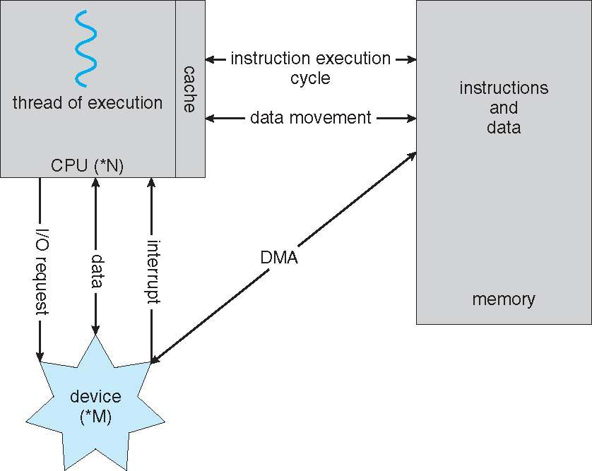
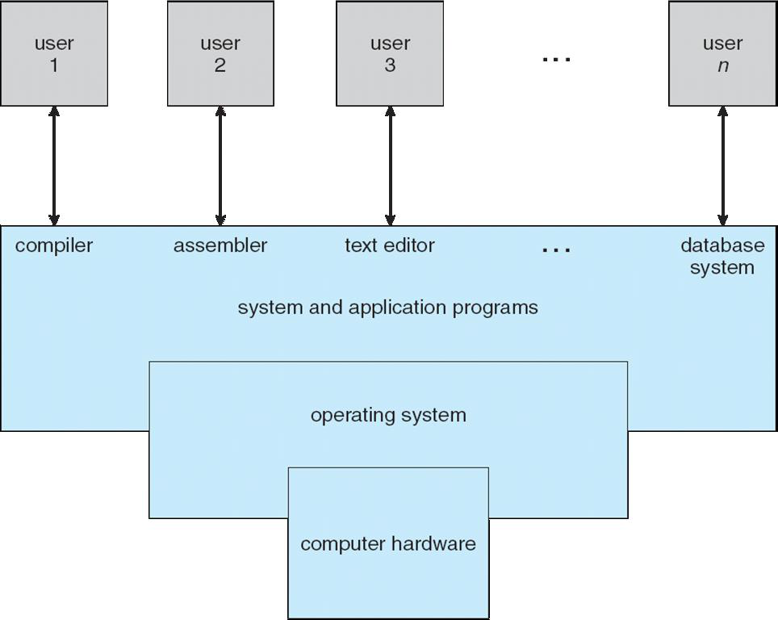
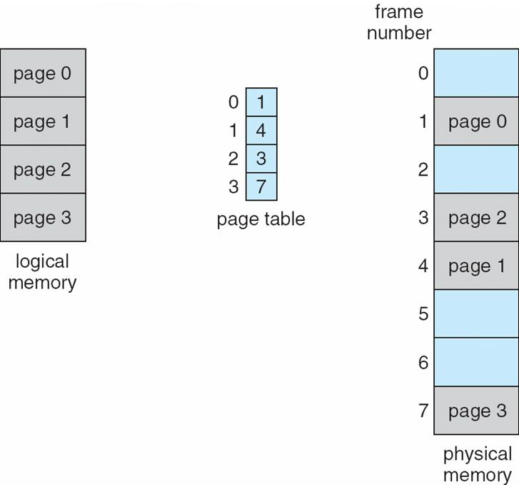
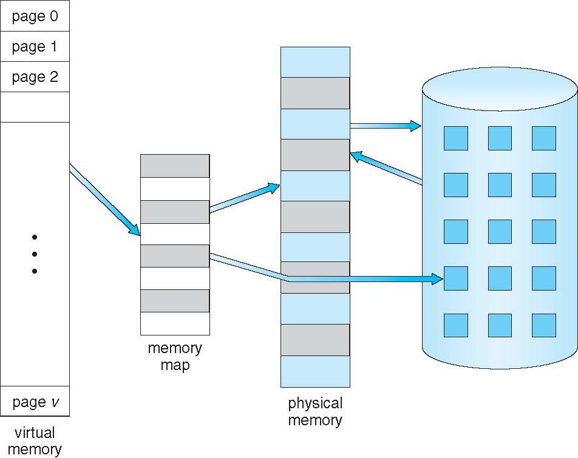
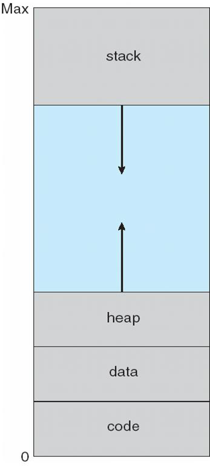
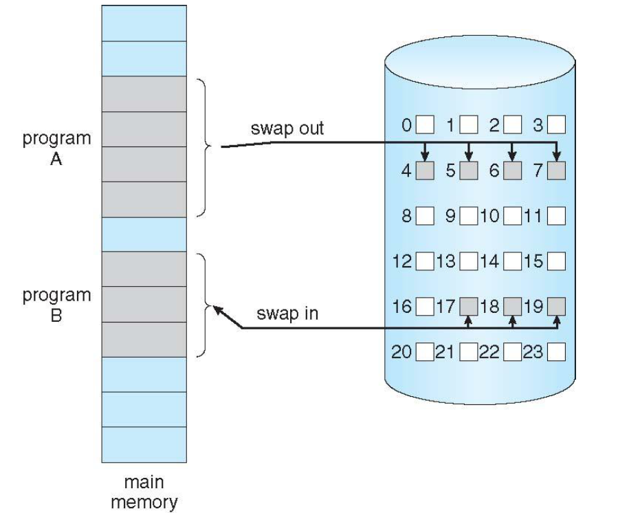
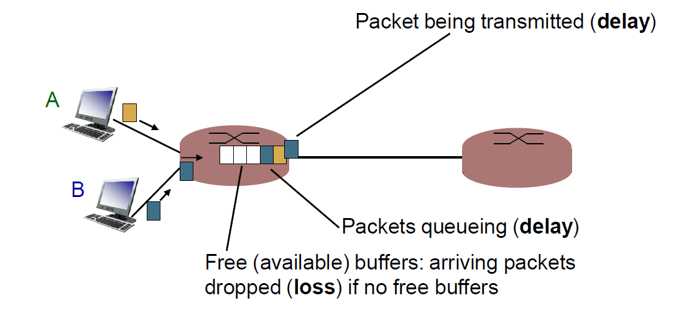

# Operating Systems and Networks

---

## Sources

### Operating systems
- Silbershatz’s operating system (OS) book and modified/ reordered
- as needed and added some of my own slides/ figures

### Networking 
- Taken from slides available online for Kurose -Ross’
- textbook on Computer Networking: A Top -Down Approach ,
- sixth edition, and adapted to suite our discussion

---

## Overview of Operating Systems
- Overview of Operating Systems

---

## How a Modern Computer Works
- How a Modern Computer Works


---
## Traditional Computing Resources
- How to manage all these resources?
- How to share these with the applications that need them?


## What is an Operating System
- A program that acts as an intermediary between a user of a computer and the computer hardware
- Operating system goals
    - Execute user programs and make solving user problems easier
    - Make the computer system convenient to use
    - Use the computer hardware in an efficient manner
    - 


---
## Operating System Definition

- OS is a resource allocator.
    - Manages all resources
    - Decides between conflicting requests for efficient and fair resource use
- OS is a control program.
    - Controls execution of programs to prevent errors and improper  use of the computer

---
## Common Functions of Interrupts
- Interrupt transfers control to the interrupt service routine generally,
through the interrupt vector, which contains the addresses of all
the service routines.
- Interrupt architecture must save the address of the interrupted
instruction.
- Incoming interrupts are disabled while another interrupt is being
processed to prevent a lost interrupt.
- A trap is a software -generated interrupt caused either by an error
or a user request.
- An operating system is interrupt driven.

---

# Processs Management

--- 

## Process Concept
- An operating system executes a variety of programs
    - Batch system: jobs
    - Time -shared systems: user programs or tasks
- Textbook uses the terms job and process almost interchangeably
- Process: a program in execution; process execution must
- progress in sequential fashion
- A process includes:
    - Program counter
    - Stack
    - Data section Process Concept

---

## Process in Memory

- Stack: Region containing function call stack, local variables, and temporary data
- Heap: Dynamic memory allocation region for objects and data structures
- Data: Contains global variables and static data initialized by the program
- Text: Program instructions and read-only data like string literals


---

## Process State
- As a process executes, it changes
state.
    - New: The process is being created.
    - Running: Instructions are - being executed
    - Waiting: The process is waiting for some event to occur.
    - Ready: The process is waiting to be assigned to a processor.
    - Terminated: The process has


---
## Process Control Block (PCB)
Information associated with each process
- Process state
- Program counter
- CPU registers
- CPU scheduling information
- Memory management information
- Accounting information
- I/O status information


---
## Process Creation
- Parent process creates children processes, which in turn create other processes, forming a tree of processes
- Generally, process identified and managed via a process identifier (PID)
- Resource sharing
    - Parent and children share all resources
    - Children share subset of parent’s resources
    - Parent and child share no resources
- Execution
    - Parent and children execute concurrently
    - Parent waits until children terminate Process Creation

---
## Sample Process Tree (on Linux)
```shell
% ps -aux
USER       PID %CPU %MEM    VSZ   RSS TTY      STAT START   TIME COMMAND
root         1  0.0  0.0  18684  2364 ?        Ss   10:55   0:00 /sbin/init
root         2  0.0  0.0      0     0 ?        S    10:55   0:00 [kthreadd]
root         3  0.0  0.0      0     0 ?        S<   10:55   0:00 [ksoftirqd/0]
root         5  0.0  0.0      0     0 ?        S<   10:55   0:00 [kworker/0:0H]
root         6  0.0  0.0      0     0 ?        S<   10:55   0:00 [rcu_sched]
root         7  0.0  0.0      0     0 ?        S<   10:55   0:00 [rcu_bh]
root         8  0.0  0.0      0     0 ?        S<   10:55   0:00 [migration/0]
root         10 0.0  0.0      0      0 ?       S<   10:55   0:00 [watchdog/0]
root         11 0.0  0.0      0      0 ?       S<   10:55   0:00 [cpuhp/0]
root         12 0.0  0.0      0      0 ?       S<   10:55   0:00 [cpuhp/1]
```

---

## Process Creation (cont.)

- Address space
    - Child duplicate of parent
    - Child has a program loaded into it
- UNIX examples
    - Fork system call creates new process
    - Exec system call used after a fork to replace the process memory space with a new program Process Creation (cont.)

---

## Single and Multithreaded Processes
- Single threaded processes
    - One Code
    - One Data
    - One set of Files
    - One thread of execution
    - One program counter
    - One stack
    - One heap
    - One set of global variables
    - One set of static data
    - One set of local variables
- Multithreaded processes
  - One Code
  - One Data
  - One set of Files
  - Multiple threads of execution
  - Multiple program counters
  - Multiple stacks
  - Multiple heaps
  - Multiple sets of local variables
  

---
    # Process/Thread Scheduling

---

## CPU Scheduler
- Selects from among the processes in memory that are ready to execute, and allocates the CPU to one of them
- CPU scheduling decisions may take place when a process:
    1. Switches from running to waiting state
    2. Switches from running to ready state
    3. Switches from waiting to ready
    4. Terminates

- Scheduling under i and iv is non-preemptive
- All other scheduling is preemptive CPU Scheduler

---

## Context Switch

- When CPU switches to another process, the system must
save the state of the old process and load the saved state
for the new process via a context switch
- Context of a process represented in the PCB
- Context switch time is overhead; the system does no
useful work while switching
- Time dependent on hardware support 

---

## Dispatcher

- Dispatcher module gives control of the CPU to the
process selected by the short -term scheduler; this
involves:
    - Switching context
    - Switching to user mode
    - Jumping to the proper location in the user program to restart that program
- Dispatch latency: time it takes for the dispatcher to stop one process and start another running Dispatcher

---

## Scheduling Criteria
- CPU utilization: keep the CPU as busy as possible
- Throughput: number of processes that complete their execution per time unit
- Turnaround time: amount of time to execute a particular process
- Waiting time: amount of time a process has been waiting in the ready queue
- Response time: amount of time it takes from when a request was submitted until the first response is produced, not output (for time - sharing environment)

---

# Memory Management

---
## Memory Management
- All data in memory before and after processing
- All instructions in memory in order to execute
- Memory management determines what is in memory when:
- Optimizing CPU utilization and computer response to users
- Memory management activities
    - Keeping track of which parts of memory are currently being used and by whom
    - Deciding which processes (or parts thereof) and data to move into and out of memory
    - Allocating and deallocating memory space as needed 
---
## Logical and Physical Memory
- Physical memory 
  - Physical storage device
  - Divided into fixed size blocks called frames (size is power of 2, between 512 bytes and 8192 bytes)
- Logical Memory
    - Divided into fixed size blocks called pages
    - Divided into two parts:
        - User memory: contains user programs and data
        - Kernel memory: contains kernel programs and data
    - User memory is divided into two parts:
        - Text: contains the instructions for the user programs

---
## Memory-Management Unit (MMU)
- Hardware device that translates logical addresses to physical addresses
- 3 types of MMU:
    - Segmented MMU
    - Paged MMU
    - TLB MMU
- User Program deals with logical addresses
    - MMU translates logical addresses to physical addresses
    - MMU translates physical addresses to frames
    - MMU translates frames to pages
    - MMU translates pages to user memory

---
## Paging
- Logical address space of a process can be noncontinuous; process is allocated physical memory whenever it is available.
- Divides physical address space into frames (fixed size between 512 and 8192 bytes)
- Divides logical address space into pages
- Keep track of all free frames
- To run a progam of size n pages, need to find n free frames  and load the program
- Set up a page table to translate logical to physical addresses
- Internal Fragmentation
---

## Paging Model of Logical and Physical Memory



--- 
## Shared Pages
### Shared code
- One copy of read -only (reentrant) code shared among
- processes (i.e., text editors, compilers, window systems)
- Shared code must appear in same location in the logical
- address space of all processes
### Private code and data
- Each process keeps a separate copy of the code and data
- The pages for the private code and data can appear anywhere
- in the logical address space
---
## Virtual Memory

- Virtual memory: separation of user logical memory from physical memory
    - Only part of the program needs to be in memory for execution
    - Logical address space can therefore be much larger than physical
    - address space
    - Allows address spaces to be shared by several processes
    - Allows for more efficient process creation
- Virtual memory can be implemented via:
    - Demand paging
    - Demand segmentation Virtual Memory

---
## Larger Than Physical Memory



---
## Virtual-Address Space
- Stack
- Virtual -Address Space
- Heap
- Data
- Code


---
## Demand Paging
- Bring a page into memory only when it is needed
    - Less I/O needed
    - Less memory needed
    - Faster response
    - More users
- Page is needed —reference to it
    - Invalid reference — abort
    - Not in memory — bring to memory
- Lazy swapper: never swaps a page into memory unless page will be needed
    - Swapper that deals with pages is a pager Demand Paging

---
## Transfer of a Paged Memory
- Transfer of a Paged Memory

---
## Page fault
- If there is a reference to a page, first reference to that page will trap to operating system
  - Page Fault

1. Operating system looks at another table to decide
    - Invalid reference: abort
    - Just not in memory
2. Get empty frame
3. Swap page into frame
4. Reset tables
5. Set validation bit = v
6. Restart the instruction that caused the page fault

---

## Copy-on-Write
- Copy -on-write (COW) allows both parent and child processes to initially share the same pages in memory.
- If either process modifies a shared page, only then is the page copied.
- COW allows more efficient process creation as only modified pages are copied.
- Free pages are allocated from a pool of zeroed out pages. 
- 
---

### What happens if There is No Free Frame?
- Page replacement: find some page in memory, but not really in use, swap it out
    - Algorithm
    - Performance: want an algorithm which will result in minimum
- Same page may be brought into memory several times 

---

## Page Replacement

- Prevent over -allocation of memory by modifying page fault service routine to include page replacement
- Use modify (dirty) bit to reduce overhead of page transfers: only modified pages are written to disk
- Page replacement completes separation between logical memory and physical memory: large virtual memory can be provided on a smaller physical memory

---

# Nuts and Bolts View of the Internet

---

## Why Understand Networks and the Internet Architecture?

- Distributed systems such as the cloud are, after all, networked systems.
- The communicating entities are geographically distributed over possibly heterogeneous networks.
- The location of the communicating entities, the underlying network architecture and protocols used, and the span of the distributed system will have substantial impact on the performance and reliability of the distributed system.
- Thus, some background on networking is important.

--- 

## What's the Internet?

- Network of interconnected computing devices
    - End systems/hosts (PCs, servers, mobile devices)
    - Running applications and services
    - Connected through communication infrastructure
- Core Infrastructure Components
    - Communication Links
        - Physical media: fiber optic, copper wire, radio waves, satellites
        - Characterized by bandwidth (data transmission rate)
    - Network Switches & Routers
        - Forward data packets between connected devices
        - Enable data flow across the network
    - Internet Service Providers (ISPs)
        - Connect end users to the broader internet
        - Form hierarchical network structure

---
## What's the Internet: (cont)

- Internet: "network of Networks"
  - Interconnected ISPs( Internet Service Providers)
- Protocols control sending, receiving of messages
    - For example, TCP, IP, HTTP, Skype, 802.11
- Internet standards
    - RFC: request for comments
    - IETF: Internet Engineering Task Force 
- Gloabl Naming Convention
    - Domain Name System (DNS)
    - Internet Protocol (IP)
    - Hypertext Transfer Protocol (HTTP)
    - Simple Mail Transfer Protocol (SMTP)
    - File Transfer Protocol (FTP)

---

# Internet Architecture

---

## What's The Internet: A Service View

- Infrastructure that provides services to applications
    - Web, VoIP, email, games, e -commerce, social nets, ...
- Provides programming interface to apps
    - Hooks that allow sending and receiving app programs to “connect” to Internet
    - Provides service options, analogous to postal service

---

## A Closer Look at the Network Structure
- Network edge
    - Hosts: clients and servers
    - Servers often in data centers
- Access networks, physical media :
    - wired, 
    - wireless communication links
- Network core
    - Interconnected routers
    - Network of networks

---
## Access Networks and Physical Media
- Question: How to connect end systems to edge router?
    - Residential access nets
    - Institutional access networks (school, company)
    - Mobile access networks
- Issues to keep in mind
    - Bandwidth (bits per second) of access network?
    - Shared or dedicated?
    - Reliability

---

## The Network Core
- Mesh of interconnected routers
- Packet -switching: hosts break application layer messages into packets
    - Forward packets from one router to the next, across links on path from source to destination
    - Each packet transmitted at full link capacity
---

## Internet Structure: Network of Networks

- End systems connect to Internet via access ISPs (Internet Service Providers).
    - Residential, company, and university ISPs
- Access ISPs in turn must be interconnected.
    - So that any two hosts can send packets to each other
- Resulting network of networks is very complex.
    - Evolution was driven by economics and national policies
- Let’s take a stepwise approach to describe current Internet structure. 

---

## Internet Structure: Network of Networks
- But if one global ISP is viable business, there will be competitors… which must be interconnected…


---

## Internet Structure: Network of Networks
... And Regional networks may arise to connect access nets to ISPs


---

## Internet Structure: Network of Networks

... And content provider networks (e.g., Google, Microsoft, Akamai) may run their own network, to bring services, content close to end users


---
# Layered Approach
---
## Layered Approach
Networks are complex, with many “ pieces”:
- Hosts
- Routers
- Links of various media
- Applications
- Protocols
- Hardware, software 

Question: Is there any hope of organizing structure of
network?
- …Or at least our discussion of networks?
Layered architecture is the solution. 

---
## Internet Protocol Stack

- Application: supporting network applications
  - FTP, SMTP, HTTP
- Transport: process -process data transfer
  - TCP, UDP
- Network: routing of datagrams from source to destination
  - IP, routing protocols
- Link: data transfer between neighboring network elements
  - Ethernet, 802.11 (Wi -Fi), PPP
- Physical: bits “ on the wire”

---
## Cloud Protocols
- Cloud -based services are usually supported at the application layer.
- They are reachable often via HTTP/HTTPS or protocols that build over the Web protocols. 
- Many of the APIs used to host and access the services are RESTful.
    - We will study Representational State Transfer (REST) in detail.
    - We will look at new protocols like MCP (Model Context Protocol)

---

# Important Considerations

---
## Reasons for Losses and Delays
- Packets queue in router buffers
- Packet arrival rate to link (temporarily) exceeds output link capacity
- Packets queue, wait for turn
    

---
## Reasons for Losses and Delays


```
dnodal = dproc + dqueue + dtrans + dprop
```

- dproc: nodal processing
    - Check bit errors
    - Determine output link
    - Typically less than a msec 
- dqueue: queueing delay
    - Time waiting at output link for
    - transmission
    - Depends on congestion level

---

## Relation to Cloud

- Cloud -hosted services are deployed in data centers, which are often many network hops away from the clients.
- The sources of losses and delays are very likely to occur when accessing the cloud -hosted services.
- These issues thus become one of the determinants of performance of cloud -hosted services experienced by the client.

---