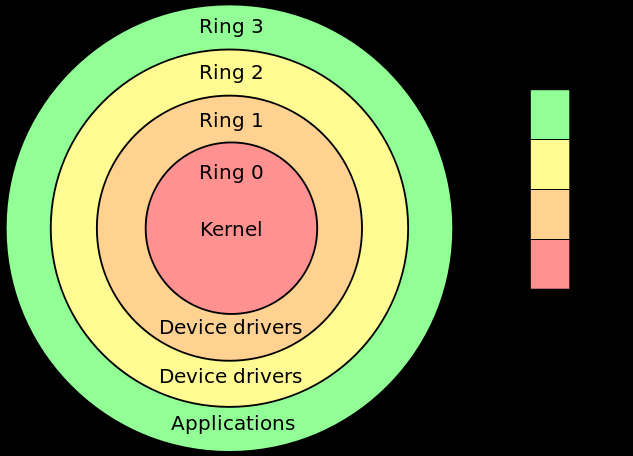
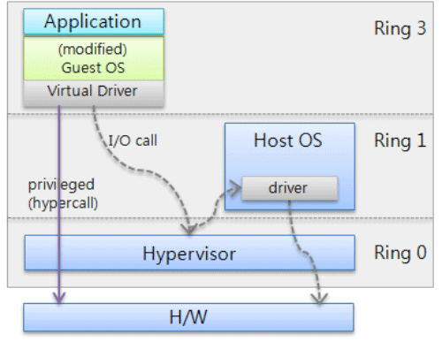

# Introduction to Virtualization

- Virtualization abstracts a physical resource (e.g., CPU) into a logical form.
- Users operate on the logical abstraction.
- Multiple logical abstractions can be multiplexed over a single physical entity.

---

## Topics Covered

- Terminology
- Advantages
- Taxonomy
- Challenges supporting virtualization in Intel Architecture (IA-32 & Itanium)
- Source: 
  - M. Rosenblum, “The reincarnation of virtual machines,” ACM Queue, 2004.
  - R. Uhlig, et al., “Intel virtualization technology,” IEEE Computer, 2005.

---

# Virtualization Terminology

- **Host**: provides physical resource.
- **Guest**: runs in the virtual resource (guest OS + guest apps).
- **Virtual Machine (VM)**: encapsulated isolation unit executing the guest.
- **Virtual Machine Monitor (VMM)**: controls VM lifecycle and guest-host translation.
- **Hypervisor**: Type 1 VMM (directly above hardware).

---

# Benefits of Virtualization

- **Workload isolation**: improves security & reliability.
- **Workload consolidation**: avoids resource waste; legacy & new systems run together.
- **Workload migration**: decouples guest from hardware; enables load balancing & recovery.

---

# Taxonomy — By Abstraction Layer

- **Hardware-level (Type 1)**: hypervisor on bare hardware; no host OS.
- **OS-level (Type 2)**: virtualization layer above host OS.
- **High-level language VMs**: above OS; app-level frameworks (JVM, .NET CLR).

---

# Taxonomy — By Resource

- **CPU virtualization**
- **Memory virtualization**: virtual RAM via MMU/IOMMU.
- **I/O virtualization**: logical disks (LUNs), virtual networks (VPN, VLAN).
- Network function virtualization will be studied later.

---

# Desired Attributes of a Virtualization Solution

- **Software compatibility**
- **Isolation** between VMs.
- **Encapsulation** for portability/migration.
- **Low overhead / high performance**.

---

# Virtualization Solutions

- **Paravirtualization** (e.g., Xen): modifies guest OS for high performance; no app changes.
- **Full virtualization via binary translation** (e.g., VMware, Virtual PC): for legacy OS; may incur performance overhead.
- Hardware advances have since enabled direct virtualization support.

---

# Fundamental Challenges (Intel IA)

- IA originally lacked hardware-level virtualization support.

---

## Virtualization Challenges for Intel IA

- Understanding ring de-privileging
- Two bits attached to each page
    - 00—highest privilege
    - 11—lowest privilege
    - 01 and 10 are in between
- Operating systems always execute at level 00 while applications run at 11
- With the introduction of VMM/hypervisors, several new challenges arise
- Note that the original Intel IA was not geared to support hardware-level virtualization

---
## Virtualization Variations Mapped to Intel x86 Rings

---

## Challenge 1 — Ring aliasing

- A piece of software is written assuming it is supposed to run at a certain privilege level
- But the software ends up running at a different privilege level
- For example, a guest OS thinks it has the highest privilege, but actually runs at a lower privilege inside the VM
- Defeats the notion of virtualization

---

## Challenge 2 — Address space compression

- An OS thinks that it has the entire virtual address space at its disposal.
- But when that OS becomes a guest OS, that cannot happen.
- The VMM must occupy some space in the address space because it must relay the guest OS’ instructions to the real hardware and back.
- Guest OS cannot have access to this area where VMM resides.
- How to ensure the guest OS does not get access to this area?
- This also defeats the notion of virtualization.

---

## Challenge 3 — Non-faulting privileged access

- An OS running as a guest thinks it has all the privileges.
- It invokes privileged instructions (not uncommon at all; happens all the time in OS).
- The invocation of privileged instruction from a lower privilege level causes a fault that gets caught by the VMM and some mitigation action is taken.
- But there are some instructions in the Intel IA that do not generate such a fault—VMM cannot catch it and mitigate the effect—guest OS figures out it has no control of the CPU—Virtualization concept is defeated.

---

## Challenge 4 — Guest transitions overhead

- System calls are invoked by applications as a way to access the resources using the OS’ help.
- Every system call entry requires a switch from user mode to kernel mode, and exit requires switch from kernel mode to user mode.
- Entry happens through the SYSENTER instruction that transitions to level 00.
- Because the guest OS does not execute at level 00, a SYSENTER on behalf of a guest application directly goes to the VMM and the guest OS does not even know anything happened.
- Thus, VMM must now emulate every guest execution of SYSENTER and SYSEXIT.
- VMM will know this because a fault will be generated that the VMM can catch
- VMM must now work with the guest OS so the latter knows that a system call was made.
- Too many such interceptions: performance degradation

---

## Challenge 5 — Interrupt virtualization overhead

- Interrupt masking is problematic in a virtualized environment
- Note that in a normal case, when interrupts are thrown, if an OS is not ready, then the OS can mask an interrupt until it is ready
- All of this can be done at privilege level 00 only
- In the virtualized environment, the VMM should do the masking for the guest OS in a transparent way
- Note that the VMM will know about this because a fault is generated
- Too many masking/unmasking events coming from multiple simultaneous VMs that run guest OS’s—tremendous performance overhead for the VMM

---

## Challenge 6 — Ring compression

- Note that the ring de-privileging uses paging or segmentation where each page has two bits
- Paging on IA-32 allows only 00 and 11 privilege levels (01 and 10 are unused)—guest OS runs at the same privilege level of 11 as the guest application
- Segment limits do not apply in 64 bit mode (i.e., if you are virtualizing a 64 bit system) because it was dropped in the 64 bit mode—you must use paging

---

## Challenge 7 — Hidden state access

- Recall that in a context switch, CPU registers get saved in process control block, etc., but these are actions taken by the real OS.
- In our environment, we are dealing with guest OS which operates in a virtual environment (at lower privilege level): they need to have access to the hidden state and save it for context switches.
- But some parts of the CPU state cannot be represented in software accessible registers at lower privilege level.

---

# Hardware-based Virtualization Solutions

- **Intel VT-x** (IA-32) and **VT-i** (Itanium).
- Adds **VMX root/non-root modes** for hypervisor/guest.
- **Virtual Machine Control Structure (VMCS)** stores guest/host state.
- New **virtualization fault** for privileged instructions in guest mode.

---

# Intel VT-x Architecture

- VT-x augments IA-32 with two forms of CPU operations.
    - VMX root mode (hypervisor mode) and VMX non-root mode (guest)
    - All four privilege levels are available in both modes
    - Virtualized versus real is identified by the VMX mode
- A new data structure called “virtual machine control structure (VMCS)” is added.
    - VMCS logically divided into two sections: guest state and host state
    - VM enter loads processor state from guest area
    - VM exit saves processor state to guest area and then loads processor state from host area
---

# Overcoming Challenges

- **Address space compression**: VMX/VM bit hides VMM space from guest.
- **Ring aliasing/compression**: guest OS runs at full privilege in VMX/VM mode.
- **Non-faulting access**: all privileged accesses now fault for VMM handling.
- **Guest transitions**: guest OS can run SYSENTER/SYSEXIT at full privilege.
- **Interrupt virtualization**: explicit hardware support.
- **Hidden state access**: all stored in VMCS.

---

# Summary

- Virtualization enables abstraction, isolation, consolidation, and migration.
- Different approaches: Type 1, Type 2, paravirtualization, full virtualization.
- Intel VT extensions resolve many legacy IA virtualization challenges.
