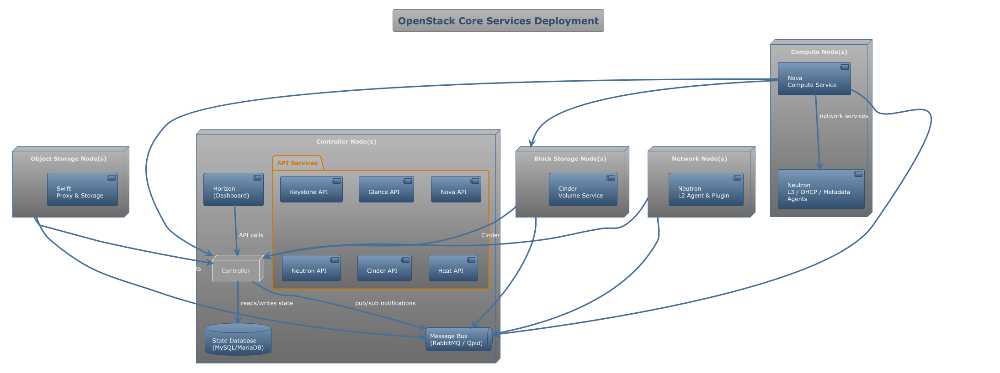

# What Is OpenStack?

- Open source “cloud OS” for building IaaS  
- Modular projects for compute, storage, networking, identity, and more  
- Managed by the OpenStack Foundation (Apache 2.0 license)  

---

## Core OpenStack Services

- **Keystone** (Identity)  
  • Authentication, multi-tenant projects, role-based access  

- **Nova** (Compute)  
  • Provision and manage virtual machines (instances)  

- **Glance** (Image)  
  • Store and retrieve VM images and snapshots  

- **Neutron** (Networking)  
  • Software-defined networking: networks, subnets, routers, floating IPs  

- **Cinder** (Block Storage)  
  • Persistent volumes attachable to instances  

- **Swift** (Object Storage)  
  • S3-style, highly durable object store  

- **Horizon** (Dashboard)  
  • Web UI for all OpenStack projects  

- **Heat** (Orchestration)  
  • Template-driven deployment of multi-service stacks  

---

## Architecture & Control Plane



---

## Installation & Deployment

### 1. All-in-One (Dev/Test)
```
bash
# On a single Ubuntu host
sudo apt update
sudo apt install -y openstack-tools
openstack-quickstart allinone
```
- Spins up Keystone, Nova, Neutron, Glance, Cinder, Horizon  

---

### 2. Multi-Node Production

- **Controller Nodes**: API services, message bus, database, dashboard  
- **Compute Nodes**: Nova compute + hypervisor  
- **Storage Nodes**: Cinder volumes & Swift proxies  
- **Network Nodes**: Neutron L3 agent, DHCP, metadata, LBaaS  

Use an installer/orchestration tool:  
- **OpenStack-Ansible**  
- **Kolla-Ansible** (containerized)  
- **TripleO** (OpenStack on OpenStack)  

---

## Common Workflows

### a) Create a Project & User
```
bash
openstack project create acme
openstack user create bob --project acme --password secret
openstack role add --project acme --user bob member
```
---

### b) Upload an Image
```
bash
openstack image create ubuntu20 \
--file ubuntu-20.04.qcow2 \
--disk-format qcow2 --container-format bare
```
---

### c) Launch a VM
```
bash
openstack server create \
--flavor m1.small \
--image ubuntu20 \
--network private-net \
--security-group default \
--key-name mykey \
web01
```
---

### d) Attach a Volume
```
bash
openstack volume create --size 10 data-vol
openstack server add volume web01 data-vol
```
---

### e) Floating IP & Security Group
```
bash
# Allocate & assign public IP
openstack floating ip create public-net
openstack server add floating ip web01 <FLOAT_IP>

# Allow SSH & HTTP
openstack security group rule create default --protocol tcp --dst-port 22
openstack security group rule create default --protocol tcp --dst-port 80
```
---

## Horizon Dashboard

- **Projects → Compute**: instances, flavors, key pairs  
- **Projects → Network**: networks, routers, subnets, security groups  
- **Admin → Identity**: users, projects, roles  
- **Orchestration → Stacks**: Heat templates and stack events  

---

## Best Practices

- **Use Heat** for repeatable, versioned deployments  
- **Separate roles**: isolate API, compute, network, and storage services  
- **Enable high availability**: clustered controllers & database replication  
- **Monitor & log**: integrate with Prometheus/Grafana, ELK/EFK stacks  
- **Secure**: TLS for all endpoints, strong RBAC policies, network segmentation  

---

# Summary

- OpenStack provides a full IaaS stack via modular, API-driven services  
- Deploy via quickstart for dev/test or Ansible/Kolla for production  
- Manage everything through CLI (`openstack`), REST APIs, or Horizon  
- Automate with Heat, enforce security, and monitor for reliability
```
