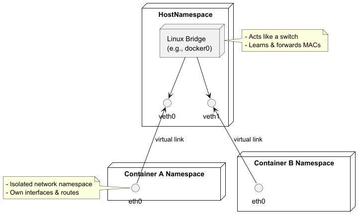
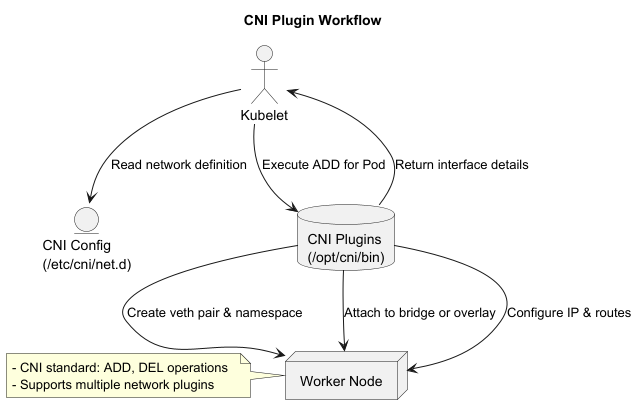
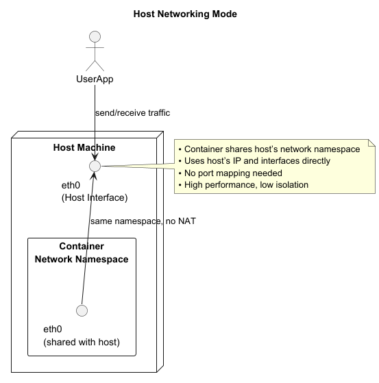
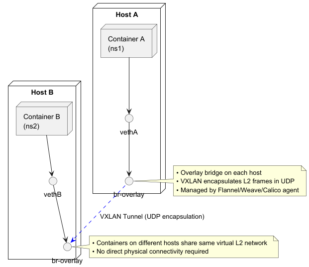
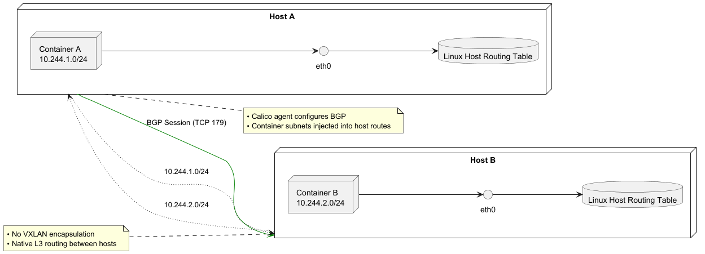
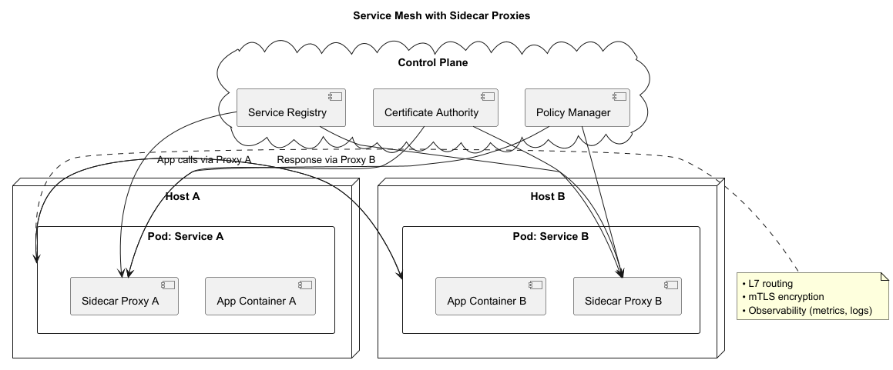
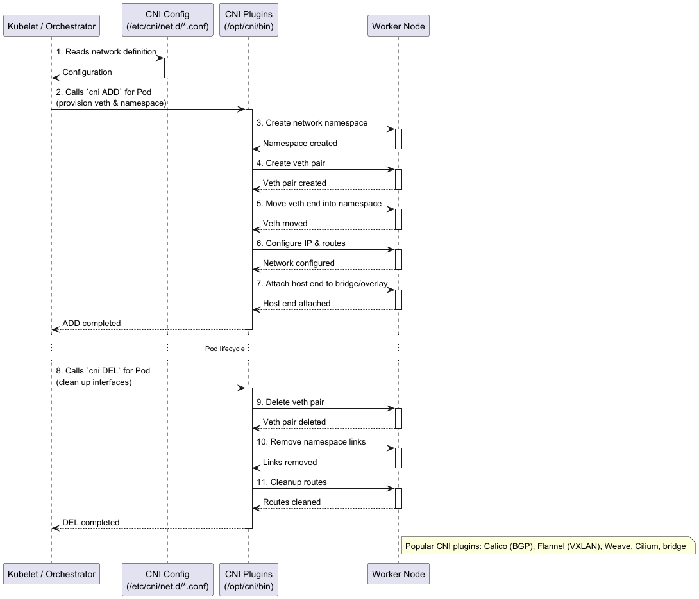

# Primer on Container Networking

Container networking provides connectivity between containers on the same host and across multiple hosts. It leverages
Linux kernel features (namespaces, virtual Ethernet pairs, bridges, overlay tunnels) and networking plugins to create
flexible, isolated, and scalable networks.

---

## Basic Building Blocks

### Network Namespaces

- Each container gets its own network namespace: isolated view of interfaces, routes, firewall rules.
- `ip netns` manages namespaces manually; orchestration tools automate namespace creation.

### veth Pairs

- Virtual Ethernet pair: two linked interfaces.
- One end lives in the container namespace (`eth0`), the other in the host namespace (e.g., `vethXYZ`).
- Packets sent on one end appear on the other.

### Linux Bridge

- Host-level bridge (`docker0`, `br0`) connects multiple veth ends.
- Acts like a virtual switch: learning MAC addresses and forwarding between ports (veths).

---

## Common Networking Modes

### Bridge (Default Docker Network)

- Containers attach to a host bridge (`docker0`).
- All containers on that host share a subnet (e.g., `172.17.0.0/16`).
- Communication: container→veth→bridge→veth→container.
- Host can forward packets using NAT for external connectivity.

[bridge.puml](bridge.puml)

### Host Networking

- Container shares the host's network namespace.
- No isolation: container's `eth0` is the host interface (e.g., `eth0`).
- Port mapping not required; high performance, but limited isolation.

### None

- Container has its own namespace but no interfaces (only loopback).
- Useful for specialized networking setups.

### MacVLAN / IPVLAN

- Directly attach a container's veth to a physical NIC with its own MAC/IP.
- Good for legacy applications requiring L2 connectivity.
- IPVLAN variants multiplex IP addresses on one MAC.

---

## Multi-Host Connectivity (Overlay Networks)

### Overlay (VXLAN)

- Encapsulate container traffic in UDP VXLAN tunnels between hosts.
- Each host runs an agent (e.g., Docker Swarm, Flannel, Weave, Calico) to manage tunnels.
- Containers on different hosts appear on the same virtual L2 network.

### BGP / Route-Based (Calico)

- Use BGP routing instead of encapsulation.
- Each host programs Linux routing tables for container subnets.
- Advantages: no encapsulation overhead, native L3 routing.

### Service Mesh (Sidecar Proxies)

- Not exactly layer 2/3, but builds an L7 overlay for east-west traffic.
- Examples: Istio, Linkerd.
- Provides service discovery, load balancing, mTLS encryption at the application layer.

---

## Container Network Interface (CNI)

- **CNI**: a pluggable standard for Kubernetes and other orchestrators.
- Each network plugin implements two operations: `ADD` (attach interfaces) and `DEL` (cleanup).
- Popular CNI plugins:
    - **Calico** (BGP/routing)
    - **Flannel** (VXLAN overlays)
    - **Weave Net** (mesh overlay)
    - **Cilium** (eBPF-based networking & security)
    - **Bridge** (simple host bridge)

CNI configuration (`/etc/cni/net.d/*.conf`) defines which plugin to use and network settings.

---

## DNS & Service Discovery

- Containers often refer to services by name rather than IP.
- Orchestrators provide DNS-based discovery:
    - Kubernetes CoreDNS / kube-dns resolves Service names to cluster IPs.
    - Docker Swarm's embedded DNS resolves `tasks.<service>` names.

---

## Security & Network Policies

- **Firewalls** (iptables, nftables) enforce per-namespace rules.
- **Kubernetes NetworkPolicies** control pod-to-pod traffic:
    - Define ingress/egress allow rules by label selectors and ports.
- **Cilium Policies** leverage eBPF for L3–L7 filtering at high performance.

---

## Best Practices

- Use **bridge** or **CNI plugins** for simple single-host dev environments.
- Choose **overlay** or **BGP/routed** networks for multi-host clusters.
- Leverage **NetworkPolicies** or **Cilium** to enforce least-privilege communications.
- Monitor network performance and MTU settings (especially with VXLAN).
- Document network design (subnets, CIDRs, policies) for operability and debugging.

---

### Summary

Container networking builds on Linux namespaces, veth pairs, and bridges for host-local connectivity, and overlays or
BGP for multi-host clusters. CNI standardizes plugin integration, while service meshes and network policies add L7
routing and security controls. Mastery of these techniques is crucial for designing scalable, secure container
platforms.