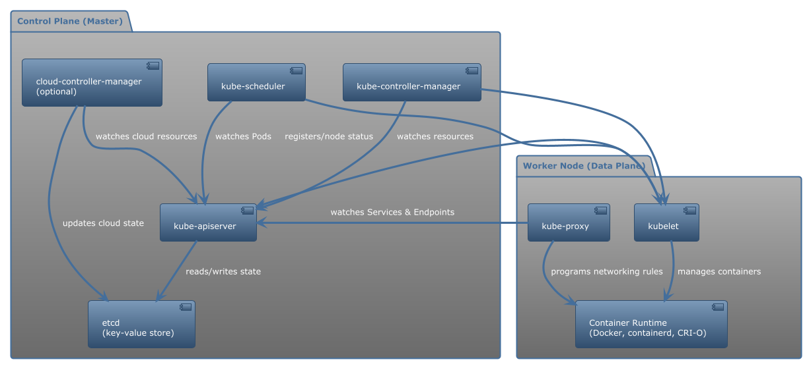
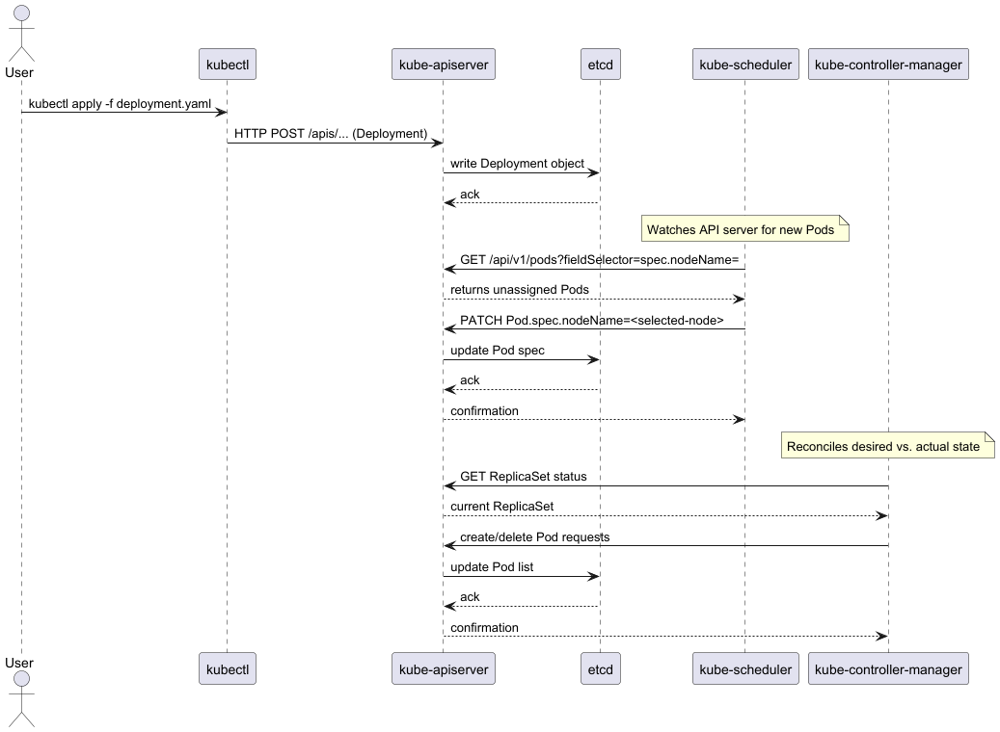
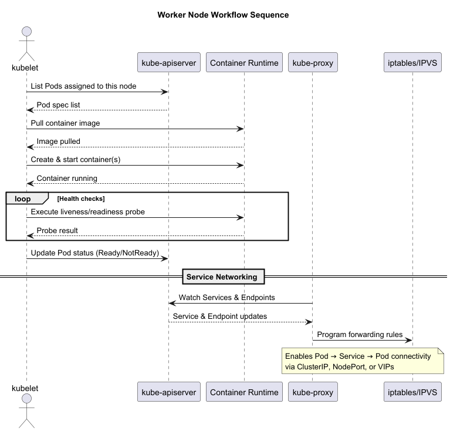
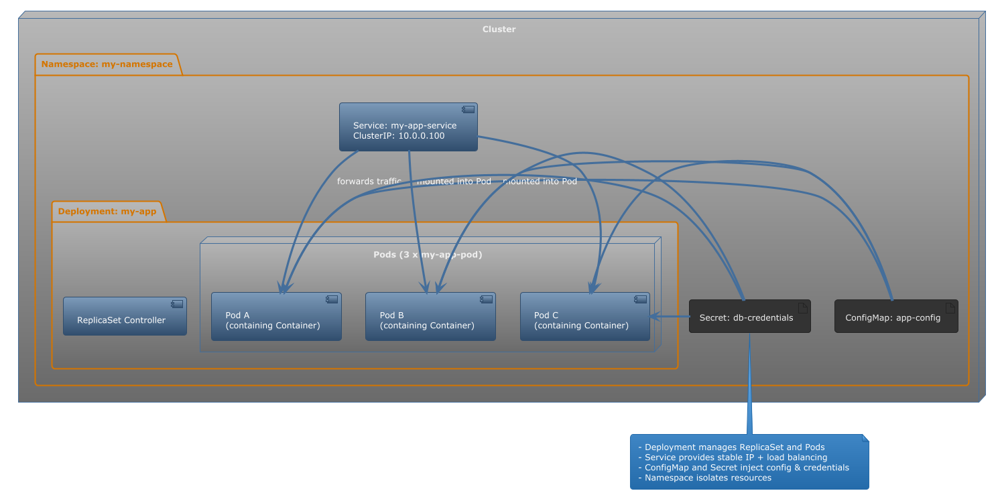

# Kubernetes Architecture Primer

Kubernetes is a container orchestration platform that automates deployment, scaling, and management of containerized applications.  
It separates **control-plane components** from **data-plane (worker node) components**.

---

--- 

## High-Level Components

### Control Plane (Master)
- **kube-apiserver** – Central REST API; all clients communicate here.
- **etcd** – Distributed key-value store for cluster state.
- **kube-scheduler** – Assigns Pods to nodes based on requirements.
- **kube-controller-manager** – Runs controllers to reconcile actual vs. desired state.
- **cloud-controller-manager** (optional) – Integrates with cloud APIs.

---

## High-Level Components (cont.)

### Worker Nodes (Data Plane)
- **kubelet** – Watches for Pod specs, ensures containers are running, reports status.
- **kube-proxy** – Service forwarding & load-balancing at node level.
- **Container Runtime** – Runs containers (Docker, containerd, CRI-O).

---

## Control Plane Workflow

---

## Control Plan Details

1. **User Action**  
   `kubectl apply -f deployment.yaml` → API call to kube-apiserver.
2. **Persistence**  
   API server writes desired state to etcd.
3. **Scheduling**  
   Scheduler assigns Pods to nodes.
4. **Reconciliation**  
   Controller-manager ensures actual state matches desired state.

---

## Worker Node Workflow

---

## Worker Node Workflow details

1. **Pod Assignment**  
   Kubelet polls API server for Pods assigned to its node.
2. **Pod Lifecycle**  
   Kubelet pulls images and starts containers.
3. **Health & Status**  
   Probes executed; status updated to API server.
4. **Service Networking**  
   Kube-proxy configures rules so Pods can reach Services.

---

## Key Objects & Concepts

---

## Key Objects & Concepts Details

- **Pod** – Smallest deployable unit; containers sharing network & volumes.
- **Service** – Stable virtual IP & load-balancing for Pods.
- **Deployment** – Declarative rollout and rollback of ReplicaSets.
- **ConfigMap & Secret** – Inject config & sensitive data.
- **Namespace** – Virtual cluster partition.
- **Admission Controller** – Enforces policies on API requests.

---

## Networking Model

- **Flat, Pod-to-Pod** – Every Pod gets a unique IP; no NAT.
- **CNI Plugins** – Implement networking (Calico, Flannel, Weave, Cilium).
- **Service IPs & Load Balancing** – kube-proxy implements VIPs; integrates with cloud LBs.

---

## High Availability & Scaling

- **HA Control Plane** – Multiple API server, scheduler, controller-manager replicas; clustered etcd.
- **Horizontal Scaling** – Add worker nodes; scheduler distributes Pods.
- **Cluster Federation** (optional) – Manage multiple clusters across regions/clouds.

---

## Observability & Security

- **Metrics & Logs** – Prometheus, EFK, Loki.
- **RBAC** – Role-based access control.
- **NetworkPolicies** – Define allowed Pod-to-Pod traffic.
- **TLS Everywhere** – Secure communication across components.

---

# Summary

Kubernetes decouples control and data planes through well-defined APIs, enabling declarative management of workloads at scale.

Understanding **API server, etcd, scheduler, controllers, kubelet, and networking** is essential for operating production clusters.
