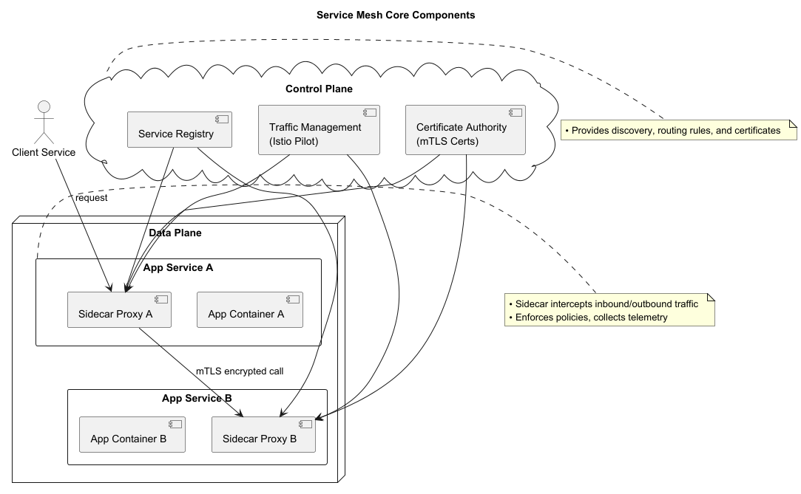

# Service Mesh Primer

A **service mesh** is an infrastructure layer that manages service-to-service communication in microservices architectures.

It abstracts networking complexity and provides **traffic management, security, and observability** without modifying application code.

---

## Core Components

### Data Plane (Sidecar Proxies)
- Deployed alongside each application container (as a sidecar).
- Intercepts outbound and inbound traffic.
- Examples: Envoy, Linkerd2 proxies.

### Control Plane
- Centralized control component that configures and manages proxies.
- Service discovery, traffic policies, mTLS certificates.
- Examples: Istio Pilot, Linkerd2 Control Plane.

---

## Key Features – Traffic Management

- **Load Balancing** – Client-side balancing across healthy instances.
- **Routing Rules** – Canary deployments, A/B testing, weighted traffic splitting.
- **Retries & Timeouts** – Define retry policies and request deadlines.

---

## Key Features – Security

- **Mutual TLS (mTLS)** – Automatic, transparent encryption of service-to-service traffic.
- **Identity & Authorization** – Fine-grained access control using service identities and policies.

---

## Key Features – Observability

- **Metrics** – Request rates, latencies, error rates per service.
- **Distributed Tracing** – End-to-end request flows across microservices.
- **Logging** – Standardized access and error logs collected by sidecars.

---

## Key Features – Resilience

- **Circuit Breaking** – Prevent cascading failures by halting calls to unhealthy services.
- **Fault Injection** – Simulate failures or delays to test resilience.

---

## How It Works

1. **Deployment**
    - Inject sidecar proxy into each service pod (Kubernetes) or container.
    - Sidecar intercepts all traffic via iptables (or equivalent).

2. **Configuration Delivery**
    - Control plane distributes routing, security, and telemetry configs to proxies via xDS API (Envoy).

3. **Runtime Operations**
    - Proxies enforce policies, collect telemetry, and forward requests.

---

## Popular Service Meshes

- **Istio** – Feature-rich; Envoy sidecars, Pilot, Citadel (mTLS), Galley.
- **Linkerd** – Lightweight; Rust/Go proxies, automatic TLS, simpler setup.
- **Consul Connect** – HashiCorp mesh with service discovery, ACLs, TLS.
- **Open Service Mesh (OSM)** – CNCF project on Envoy, Azure AKS integration.

---

## Use Cases

- Secure service-to-service communication in **zero-trust** environments.
- Fine-grained traffic control for **progressive deployments**.
- **Telemetry** for SRE and performance optimization.
- **Chaos engineering** via fault injection.

---

## Best Practices

- **Start Small** – Enable basic mTLS and metrics first.
- **Adopt Incrementally** – Apply policies gradually to critical services.
- **Monitor Overhead** – Sidecars add CPU/memory usage.
- **Namespace Isolation** – Separate mesh-enabled and non-mesh workloads.
- **Automate Cert Rotation** – Ensure seamless mTLS renewal.

---

# Summary

A **service mesh** transparently enhances microservices with:
- Robust traffic management
- Strong security (mTLS, RBAC)
- Deep observability
- Built-in resilience

By **decoupling networking from app code**, teams can **iterate faster** while maintaining **reliability and security at scale**.
