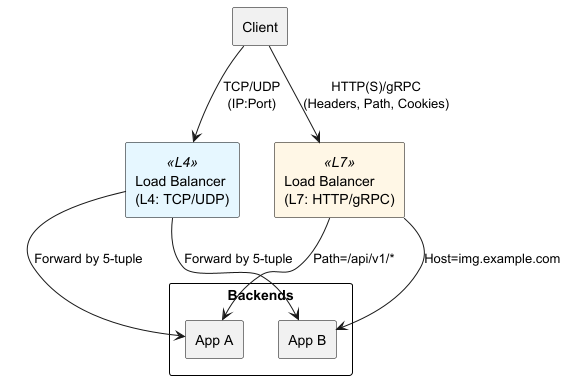
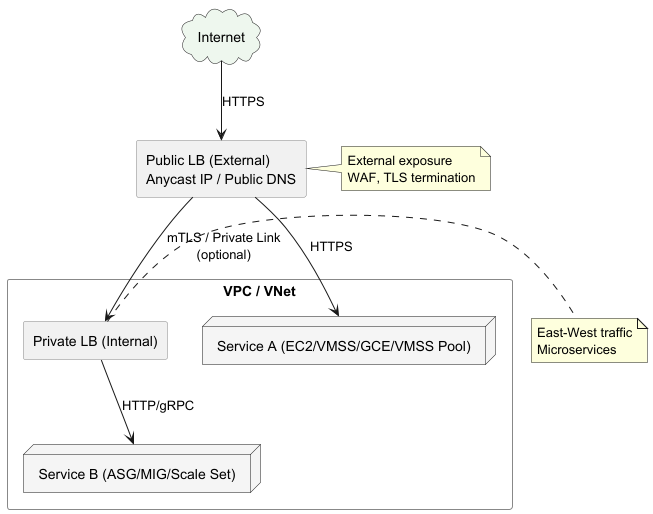
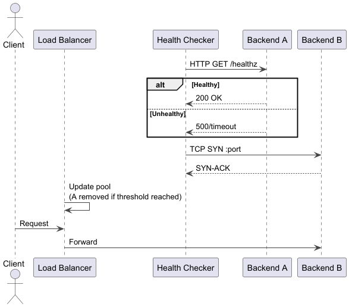
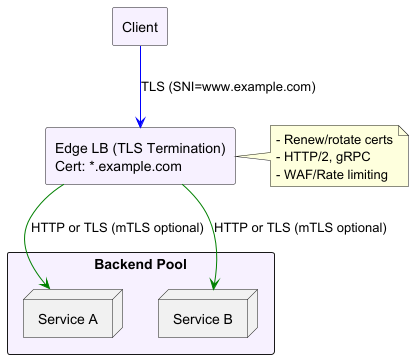

# Cloud Load Balancing
Distributes incoming traffic across multiple backend servers or services to improve:
- Availability
- Scalability
- Performance

Cloud providers offer managed services at:
- **Layer 4** (transport)
- **Layer 7** (application)

---

## Why Load Balance?

- **High Availability**  
  Detect and remove unhealthy instances; fail traffic over to healthy backends.

- **Scalability**  
  Spread load over many servers; autoscale backend pool in response to demand.

- **Performance & Latency**  
  Route clients to the nearest or least-loaded backend.

- **Security & Observability**  
  Centralized SSL/TLS termination, logging, and metrics collection.

---

## Load Balancer Types

---

### Layer 4 (Transport-Level)
- Operates on TCP/UDP: uses IP addresses and ports.
- Simple, high-performance forwarding.
- No visibility into HTTP paths or headers.
- Supports TCP, UDP, SSL (TLS pass-through).

Examples:
- AWS Network Load Balancer (NLB)
- Google Cloud TCP/UDP Load Balancer
- Azure Load Balancer

---

### Layer 7 (Application-Level)
- Operates on HTTP(S)/gRPC: understands request fields.
- Advanced routing by URL path, host header, HTTP method, cookies.
- Supports SSL/TLS termination, request rewriting, WebSocket.

Examples:
- AWS Application Load Balancer (ALB), API Gateway
- Google Cloud HTTP(S) Load Balancer
- Azure Application Gateway

---

## Deployment Models

---

## Deployment Models

- **External (Public-Facing)**  
  Routes internet traffic into your VPC/network.  
  • Edge-optimized worldwide anycast IP.

- **Internal (Private-Facing)**  
  Balances traffic within a private network (e.g., between microservices).

- **Regional vs. Global**  
  • Regional LB routes within one region.  
  • Global LB routes by geographic proximity or latency.

---

## Health Checks

---

## Health Checks

- Probe backends on TCP port, HTTP endpoint, or gRPC method.
- Configurable settings: interval, timeout, unhealthy/healthy thresholds.
- Unhealthy backends are automatically removed from rotation.

---

## Traffic Distribution Algorithms

- **Round Robin** – Equal distribution in sequence.
- **Least Connections** – Route to backend with fewest active connections.
- **Latency-Based (Proximity)** – Send clients to the lowest-latency endpoint.
- **Weighted** – Assign higher traffic share to specific backends.

---

## SSL/TLS Termination

---

## SSL/TLS Termination Details

- Offloads certificate management to the LB.
- Decrypts traffic, forwards unencrypted (or re-encrypts) to backends.
- Supports **SNI** (multiple domains on one LB).

---

## Advanced Features

- **Content-Based Routing** – Path/header rules direct to backend pools.
- **Connection Draining** – Graceful removal of backends during updates.
- **Sticky Sessions** – Affinity for repeated client requests.
- **Web Application Firewall (WAF)** – Protects against web exploits.
- **Autoscaling Integration** – Scale backend pools based on LB metrics.

---

## Best Practices

1. **Use Health Checks** for fast failure detection.
2. **Separate Internal & External LB** roles.
3. **Implement SSL at the Edge** for security.
4. **Use Global LB** for multi-region failover.
5. **Leverage Autoscaling** tied to LB metrics.
6. **Secure LB API**: restrict modifications.
7. **Monitor LB Metrics**: connections, requests, latency, errors.

---

# Conclusion

Cloud load balancers are critical for:
- **Resilience**
- **Scalability**
- **Security**

By understanding:
- L4 vs. L7
- Health checks
- Routing algorithms
- Autoscaling integration

→ You can design robust multi-cloud traffic distribution architectures.
