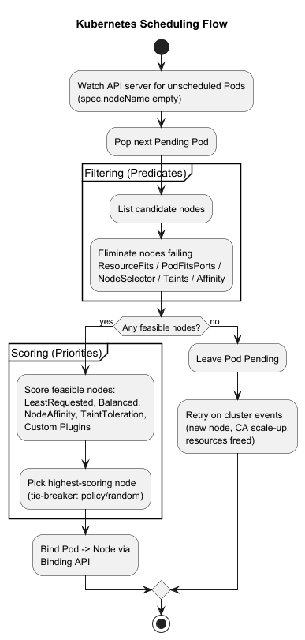
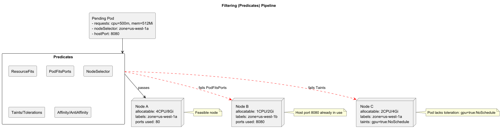
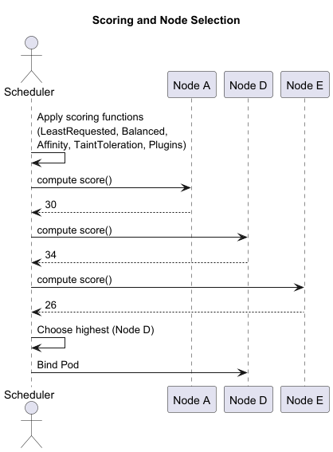
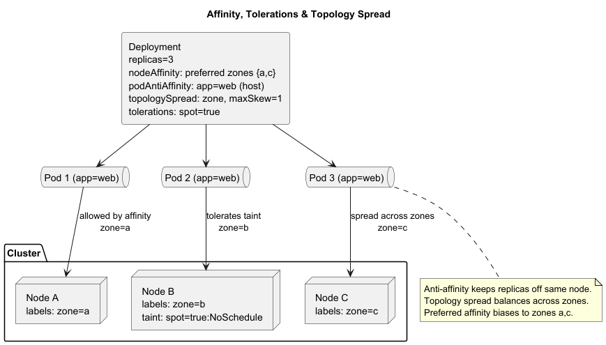
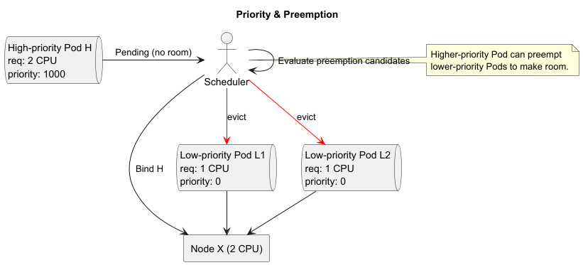
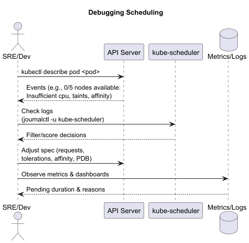

# Lecture: Kubernetes Scheduling

The Kubernetes scheduler (`kube-scheduler`) is responsible for assigning Pods to nodes based on resource requirements, constraints, and policies. Effective scheduling ensures high utilization, performance, and adherence to application-specific placement needs.

---

## Scheduling Flow

1. **Watch for Unsassigned Pods**  
   Scheduler watches the API server for Pods whose `spec.nodeName` is unset.

2. **Filtering (Predicates)**  
   Evaluate which nodes are feasible by checking:
    - **ResourceFits**: CPU, memory, and ephemeral-storage requests ≤ node allocatable.
    - **PodFitsPorts**: requested host ports not already in use.
    - **PodFitsNodeSelector**: node labels match Pod `nodeSelector`.
    - **PodFitsTaints**: node taints tolerated by Pod `tolerations`.
    - **PodFitsNodeAffinity**: matches affinity/anti-affinity rules.
    - **PodFitsInterPodAffinity**: respects `podAffinity` and `podAntiAffinity` rules.

3. **Scoring (Priorities)**  
   Score each feasible node to select the “best” one:
    - **LeastRequestedPriority**: prefers nodes with more free resources.
    - **BalancedResourceAllocation**: prefers balanced CPU/Mem usage.
    - **NodeAffinityPriority**: favors preferred node affinities.
    - **TaintTolerationPriority**: penalizes nodes with taints the Pod tolerates.
    - **Custom Plugin Scores** via scheduling framework.

4. **Binding**  
   Scheduler posts a `Binding` API call to assign the Pod to the chosen node.

5. **Retries & Evictions**  
   If binding fails or node becomes unschedulable, scheduler retries or leaves Pod pending.

---

## Key Concepts

- **Node Capacity & Allocatable**  
  `allocatable = capacity − systemReserved − kubeReserved − evictionThresholds`.

- **Requests vs. Limits**  
  Scheduling decisions use **requests**. Limits enforce runtime cgroups.

- **Taints & Tolerations**  
  Nodes can repel Pods (`taints`). Pods that tolerate can schedule there.

- **Node & Pod Affinity**
    - **NodeAffinity**: select nodes by labels; hard (`requiredDuringScheduling`) vs. soft (`preferredDuringScheduling`).
    - **PodAffinity/AntiAffinity**: co-locate or separate Pods by labels.

- **Topology Spread Constraints**  
  Spread Pods evenly across zones, nodes, or custom topology domains.

- **Scheduler Extenders & Plugins**  
  Extend or replace default logic (e.g., custom resource managers, zone-aware schedulers).

---

## Configuration & Tuning

- **Scheduling Profiles**  
  Define multiple scheduler configurations (`profiles`) for different workloads.

- **Priority & Fairness**
    - Control API request throughput to the scheduler.
    - Use PodPriority & Preemption for high-importance Pods to evict lower- priority ones.

- **Resource Quotas & LimitRanges**  
  Constrain per-namespace resource consumption and enforce request/limit defaults.

---

## Debugging Scheduling

- **kubectl describe pod <pod>**  
  Shows events: “0/5 nodes are available: 5 Insufficient cpu …”

- **Scheduler Logs**  
  On manager nodes: `/var/log/kube-scheduler.log` or via systemd (`journalctl -u kube-scheduler`).

- **Dry-Run Scheduling**  
  Simulate scheduler decisions with `--dry-run=server` on `kubectl create`.

---

## Best Practices

1. **Set Requests Carefully**  
   Avoid over-requesting (wastes capacity) or under-requesting (risk OOM, CPU throttling).

2. **Use Affinity Sparingly**  
   Heavy affinity rules can reduce scheduling flexibility and increase Pending Pods.

3. **Leverage Topology Spread**  
   Distribute replicas across failure domains (zones, nodes).

4. **Monitor Pending Pods**  
   Alert on long-pending Pods to detect scheduling bottlenecks.

5. **Scale Nodes**  
   Combine scheduler with Cluster Autoscaler to add capacity for queued Pods.

---

# Conclusion

Kubernetes scheduling balances resource constraints, affinity rules, and workload priorities to place Pods on suitable nodes. Understanding predicates, priorities, and scheduling extensions empowers you to optimize placement, ensure high availability, and maintain cluster efficiency.