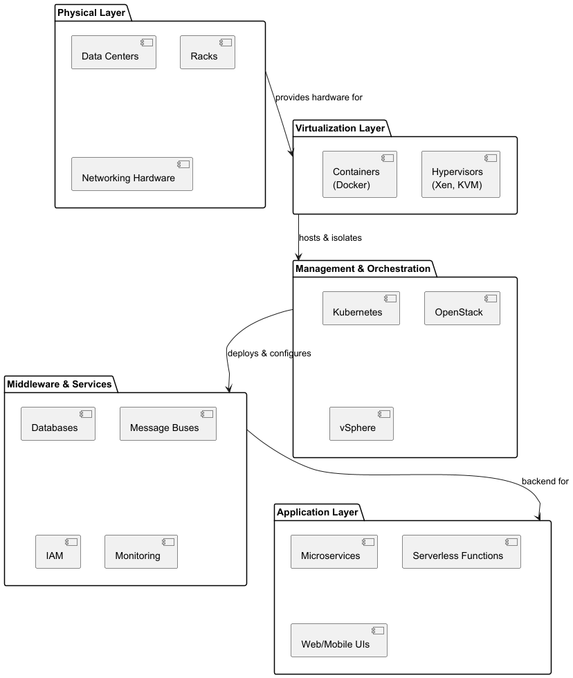

# Edge Computing and Cloud Architecture
## A Hybrid Approach for Modern Applications

---

# 1. Introduction

## 1.1 Definitions
- **Cloud Computing**
    - On-demand scalable compute, storage, networking
    - Delivered by providers (AWS, Azure, GCP)
    - Abstracts physical infrastructure
- **Edge Computing**
    - Decentralized extension of cloud to the network edge
    - Processing close to sensors & devices
    - Minimizes latency, saves bandwidth, boosts reliability

---

# 1. Introduction (cont.)

## 1.2 Motivation for Hybrid Architectures
- Explosive IoT growth
- Real-time analytics (smart factories, AR/VR)
- Data sovereignty & regulatory constraints
- Cost optimization via local filtering

**Discussion Prompt**
> What daily application could benefit from edge processing over pure cloud?

---

# 2. Cloud Architecture Overview

## 2.1 Architectural Layers
1. **Physical Layer**
    - Data centers, racks, networking hardware
2. **Virtualization Layer**
    - Hypervisors (Xen, KVM), containers (Docker)
3. **Management & Orchestration**
    - Kubernetes, OpenStack, vSphere
4. **Middleware & Services**
    - Databases, message buses, IAM, monitoring
5. **Application Layer**
    - Microservices, serverless, web/mobile UIs

---

# 2. Cloud Architecture Overview (cont.)

## 2.2 Key Benefits
- Elastic scalability (auto-scale)
- Global distribution (regions, AZs)
- Managed services reduce ops burden
- Pay-as-you-go pricing

## 2.3 Common Challenges
- Latency & user experience
- Egress bandwidth costs
- Regional outages
- Compliance (GDPR, HIPAA)

---

# 3. Edge Computing Overview

## 3.1 Core Drivers
- Ultra-low latency (sub-10 ms)
- Bandwidth savings via local preprocessing
- Disconnected operation & sync
- Data privacy & local processing

## 3.2 Types of Edge Nodes
- **Device Edge**: phones, cameras, wearables
- **Local Edge**: on-prem gateways, edge appliances
- **Regional Edge**: telco PoP micro-data centers
- **Cloud Edge Services**: AWS Wavelength, Azure Edge Zones

---

# 3. Edge Computing Overview (cont.)

## 3.3 Reference Architecture
- **Edge Agent**: runtime, health monitoring
- **Workload Manager**: deploys containers, enforces policies
- **Data Plane**: local storage & streaming pipelines
- **Control Plane**: centralized orchestrator for updates

## 3.4 Security Considerations
- TPM / Secure Element for device identity
- Mutual TLS, local data encryption
- Secure boot & firmware verification

---

# 4. Cloud-to-Edge Continuum

## 4.1 Layers & Functions
- **Cloud Core**: batch analytics, archives
- **Fog / Regional Edge**: aggregation, caching, inference
- **Local Edge**: real-time control, filtering
- **Device**: fastest loops, UI rendering

## 4.2 Integration Patterns
- Hierarchical data flow
- ML function offloading
- Event-driven messaging (MQTT → gRPC)
- Message Bus(Pub Sub Hub, Kafka, Pulsar, RabbitMQ)

---

# 5. Use Cases

## 5.1 AR/VR
- < 20 ms latency for immersion
- Edge GPU rendering + cloud updates

## 5.2 Healthcare Monitoring
- Wearables preprocess vitals
- Local alerts + cloud analytics

---

# 5. Use Cases (cont)

## 5.3 Retail & Smart Buildings
- Edge ML for occupancy detection
- Chain-wide insights in cloud dashboards

## 5.4 Autonomous Vehicles
- In-vehicle perception & control
- Edge nodes at cell towers for C-ITS
- Cloud for fleet telemetry

---

# 6. Challenges & Best Practices

## 6.1 Resource Constraints
- Model optimization (quantization, pruning)
- Minimal base images (Alpine, Distroless)

## 6.2 Deployment & Management
- GitOps (Flux, Argo CD)
- Canary & blue/green edge rollouts

---

# 6. Challenges & Best Practices

## 6.3 Security & Compliance
- Hardware root of trust
- Policy engine (OPA, Istio) with local enforcement

## 6.4 Interoperability
- Open standards (OPC UA, LwM2M)
- Protocol bridges in gateways

---

# 7. Future Trends & Research

- TinyML (TensorFlow Lite, Edge Impulse)
- 5G standalone & network slicing
- Serverless at edge (Lambda@Edge, Workers)
- Federated learning across nodes
- Edge AI hardware (Jetson, Coral, Movidius)

**Research Prompt**
> Trade-offs: federated vs centralized model training

---

# 8. Conclusion & Next Steps

## Recap
- Cloud = scale & analytics
- Edge = responsiveness & local processing
- Hybrid = balanced performance, cost, compliance

## Action Items
1. Propose cloud–edge topology for a real problem
2. Identify security threats & mitigations
3. Prototype edge function (e.g., image classification on Pi)

---