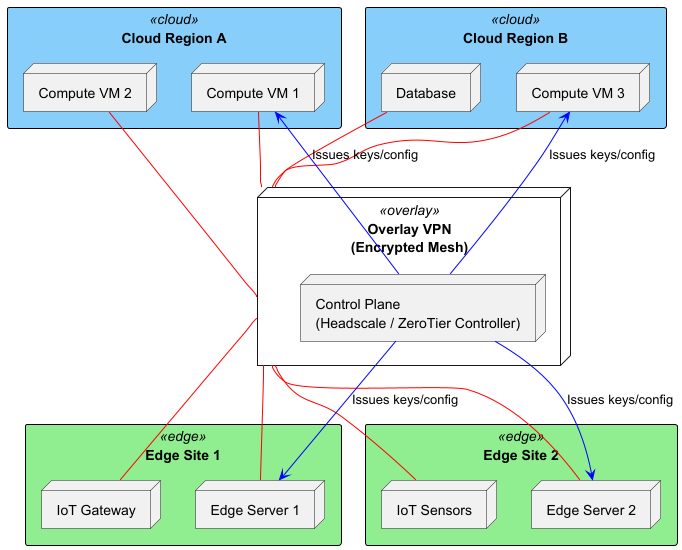

# Overlay VPN Networking
## Headscale (Self-Hosted) vs. ZeroTier

---

# 1. Introduction to Overlay VPNs
- Virtual networks “over” existing IP networks
- Encrypted, peer-to-peer tunnels
- Automatic NAT traversal (hole-punching, relays)
- Crypto-authenticated identities, not IP ACLs

---

# 2. Core Components & Terminology

## 2.1 Control Plane
- Manages node identities, keys, policies
- Headscale: open-source Tailscale control server
- ZeroTier: cloud-hosted or self-hosted controller

## 2.2 Data Plane
- Encrypted tunnels
    - WireGuard for Headscale/Tailscale
    - Custom UDP/TCP for ZeroTier
- DERP/STUN relays for NAT traversal

---

# 2. Core Components & Terminology (cont)

## 2.3 Networks & Policies
- Virtual subnets (e.g. 100.x.y.z/24)
- ACLs / flow rules govern connectivity

---

# 3. Headscale Architecture & Setup

## 3.1 Architecture
1. Headscale server + database
2. Tailscale clients point to Headscale
3. Control-plane issues WireGuard configs

---

## 3.2 Quick Setup
1. Deploy Headscale (Docker/K8s)
2. Configure DB (SQLite/PostgreSQL)
3. Create admin user & namespace
4. Install `tailscaled` on endpoints
5. `tailscale up --login-server=https://<host>`
6. Define YAML ACLs

---

# 4. ZeroTier Architecture & Setup

## 4.1 Architecture
- ZeroTier controller (cloud or self-hosted)
- ZeroTier edge daemon on each node
- Controller authorizes and distributes configs

## 4.2 Quick Setup
1. Sign up for ZeroTier Central or deploy controller
2. Create network → note network ID
3. Install `zerotier-one` on endpoints
4. `zerotier-cli join <networkID>`
5. Authorize nodes in UI
6. (Optional) Configure managed routes

---

# 5. Comparative Analysis

| Feature                 | Headscale + Tailscale | ZeroTier (Managed)    | ZeroTier (Self-Hosted) |
|-------------------------|-----------------------|-----------------------|------------------------|
| Control Plane Owner     | You                   | ZeroTier, Inc.        | You                    |
| Protocol                | WireGuard             | Custom UDP/TCP        | Custom UDP/TCP         |
| NAT Traversal           | DERP + hole-punch     | STUN + relay          | STUN + relay           |
| ACL Flexibility         | High (YAML)           | Moderate (flow rules) | Moderate (flow rules)  |
| SSO / Audit             | OIDC/SAML, logs       | Limited               | You integrate          |
| Operational Overhead    | Moderate              | Low                   | Moderate               |

---

# 6. Security & HA

## 6.1 Key Management
- Rotate control-plane certs & keys
- Use KMS/HSM for long-term secrets

## 6.2 Segmentation & Policies
- Headscale namespaces or ZeroTier flow rules
- Apply least-privilege access

## 6.3 High Availability
- Headscale: multiple instances + shared DB
- ZeroTier: clustered or active/passive controllers

---

# 7. Use Cases & Scenarios
1. Remote developer connectivity
2. IoT & edge device meshes
3. Multi-cloud/hybrid networking
4. Disaster-recovery tunnels

---

# 8. Best Practices
- Secure and monitor control plane (MFA, TLS)
- Automate key rotation & provisioning
- Test HA failover regularly
- Monitor latency, throughput, and relay usage
- Plan non-overlapping virtual subnets