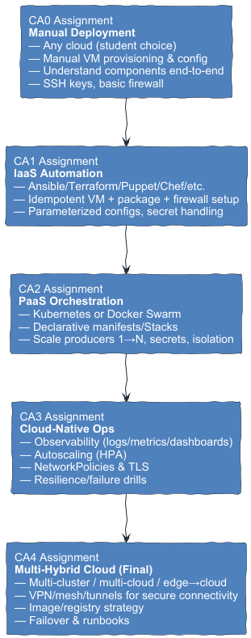

# Cloud Computing Course Projects (CA0–CA4)

This course walks you through the same IoT data pipeline across five cloud modalities:

## Reference stack options and documentation requirements

The core IoT pipeline—**Producers → Kafka Pub/Sub hub → Processor → DB/Analytics**—should remain stable from CA0 through CA4 so that we can focus on learning cloud modalities rather than reinventing the software stack. Nevertheless, you must:

- Document your **starting point**: list exact container images, versions, VM sizes, network settings, and any configuration files.
- Note **every change** you introduce in subsequent assignments (e.g., updated image tags, different cloud-provider defaults, or new security group rules).
- Explain **why** a change was necessary (platform update, performance tuning, security hardening, etc.).

Students may elect to use an alternative but equivalent stack (for example, RabbitMQ instead of Kafka or PostgreSQL instead of MongoDB). Any variation **must** still satisfy:

1. A **pub/sub hub** for event delivery (e.g., Kafka, RabbitMQ, Google Pub/Sub).
2. A **REST interface** (at least one endpoint) for control or data retrieval.
3. A minimum of **four distinct services or VMs** in both CA0 and CA1—for example:
    - Producer (simulator or replay image)
    - Broker (Kafka cluster node)
    - Processor (inference, transform, or filter service)
    - Database (MongoDB, CouchDB, etc.)

### Example Reference Stack

- **Producers**: `public-ehr-generator:latest` (simulates IoT data)
- **Kafka**: `bitnami/kafka:3.5.0` running on a dedicated VM
- **Processor**: `tensorflow/serving:2.12.0` container performing lightweight inference
- **DB/Analytics**: `mongo:6.0.4` with a second VM for monitoring dashboards

## Roadmap

- **[CA0 – Manual Deployment](./CA0-Manual/index.md)**  
  Any cloud provider, manual VM setup. Learn the parts end-to-end.

- **[CA1 – Infrastructure as Code (IaC)](./CA1-IaC/index.md)**  
  Recreate CA0 using automation (Ansible/Terraform/Puppet/Chef/etc.).

- **[CA2 – PaaS Orchestration](./CA2-PaaS/index.md)**  
  Run the pipeline on Kubernetes **or** Docker Swarm using declarative manifests.

- **[CA3 – Cloud-Native Ops](./CA3-CloudNativeOps/index.md)**  
  Observability (logs/metrics), autoscaling, security hardening, resilience tests.

- **[CA4 – Multi-Hybrid Cloud (Final)](./CA4-MultiHybrid/index.md)**  
  Distribute components across sites/clouds with secure connectivity and failover.



## Grading rubric (applies to each assignment)

All assignments should be submitted by the due date and must be checked into a git repository that the professor can
access. For example, if your github account is "madajaju", the repository should be structured as:

```
github.com/madajaju/CS5287/
├── CA0/
│ └── README.md
├── CA1/
│ └── README.md
├── CA2/
│ └── README.md
├── CA3/
│ └── README.md
└── CA4/
└── README.md
```

Each assignment should be in its own directory on the "main" or "master" branch as shown above. The directory names must be
CA0, CA1, etc.

Each assignment should contain a README.md file that contains links to the relevant documentation and code for the
assignment. These links should reference files within the same directory structure as the README.md file.

It is your responsibility to ensure that the code is correct and that the pipeline works as expected.

I will be using Generative AI to augment my grading of the assignments. Assignments are due at midnight on the due date. **No late submissions will be accepted.**

| Category | Weight |
|---|---:|
| Correctness & completeness | 15% |
| Cloud-model execution | 25% |
| Security | 15% |
| Automation & reproducibility | 10% |
| Documentation & diagrams | 30% |
| Demo quality | 5% |


Please run a Generative AI asking to to grade your assignment based on the rubric above. I am basically doing the same thing as you. With my own prompts.
** I will not give you the prompts I am using. So do not ask me for them. **

## Reference stack options

- **Kafka**: `apache/kafka` or Bitnami images (KRaft ok)
- **DB**: `mongo` or `couchdb`
- **Processor**: lightweight inference demo (e.g., ResNet server image) or transform container
- **Producers**: public data-replay images or simple generator container

Keep the *same logical architecture* through CA0→CA4; change only the **cloud modality**.

## Assignment Due Dates

| Assignment                     | Assigned (Week) | Due (Friday, 11:59 PM CT) |
|--------------------------------|-----------------|---------------------------|
| CA0 – Manual Deployment        | Week 1          | Sep 5, 2025               |
| CA1 – Infrastructure as Code   | Week 3          | Sep 19, 2025              |
| CA2 – PaaS Orchestration       | Week 5          | Oct 17, 2025              |
| CA3 – Cloud-Native Ops         | Week 9          | Nov 7, 2025               |
| CA4 – Multi-Hybrid Cloud (Final)| Week 11         | Dec 5, 2025               |